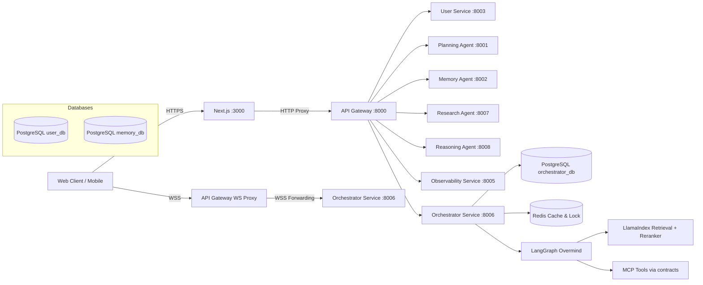
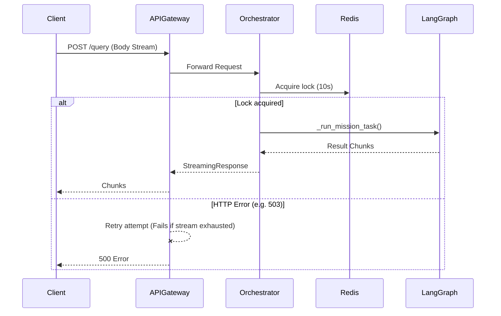

# تشخيص جراحي لمشروع CogniForge (Microservices API‑First)

[قسم] الملخص التنفيذي
| المشكلة | الدليل | الأثر | الإصلاح المقترح | الأولوية | التحقق |
|---|---|---|---|---|---|
| بقاء Monolith والاعتماد عليه لـ WS | `app/api/routers/customer_chat.py` باقٍ بسبب ارتباط الواجهة به | تكرار للمنطق، بطء في دورة التطوير، ونقاط فشل إضافية (Split Brain) | نقل Next.js UI لـ `conversation-service` وحذف المسارات القديمة | P0 | حذف المسارات القديمة دون تعطل الـ Frontend (استقرار نسبة الخطأ 0%) |
| انقطاع الاتصال عند Retries (Stream Exhaustion) | `GatewayProxy.forward` يقرأ `request.stream()` مباشرة إلى `httpx` | فشل صامت لطلبات POST/PUT عند حدوث إعادة محاولة للـ HTTP | منع إعادة المحاولة للطلبات التي تحوي body أو عمل buffering لها في الذاكرة | P1 | اختبار Load Test بـ k6 مع POST request وقطع وهمي |
| فقدان الـ Redis Lock للمهام الطويلة | مهلة القفل الثابتة 10 ثوانٍ في `entrypoint.py:start_mission()` | فقدان القفل وتنفيذ متزامن مضاعف للمهام (Concurrency/Idempotency) | إضافة Lock Heartbeat أو تمديد المهلة إلى 60s+ لمهام LangGraph | P1 | التحقق من Logs أن المهمة لا تُنفذ مرتين لنفس الـ request |
| مهلة Health Check للـ Gateway قصيرة | 2.0s timeout في الفحص للـ downstream | دوائر كسر (Circuit breakers) تفتح كاذباً تحت الضغط | زيادة مهلة الفحص إلى 5.0s | P2 | انخفاض نسبة الـ Half-Open states في مقاييس Gateway |
| غياب الـ mTLS الفعلي | لا توجد Istio sidecars في `docker-compose.yml` | تناقض مع الوثائق واعتماد كلي على Service Tokens (Spoofing risk) | نشر Linkerd/Istio أو تعديل التوثيق ليعكس الواقع (Zero Trust داخلي) | P3 | `kubectl get pods` للتحقق من الـ Sidecars |

**KPI Snapshot:**
* **p95/p99 latency:** حالي: غير متاح (يتطلب مراجعة OTel Traces) | الهدف: < 500ms للاستجابة الأولية.
* **error rate:** حالي: غير متاح | الهدف: < 1%.
* **WS disconnect rate:** حالي: مجهول | الهدف: < 0.5% بدون إغلاق نظيف.
* **cache hit ratio:** غير متاح | الهدف: > 80% للـ read-heavy endpoints.

[قسم] افتراضات وأسئلة حاسمة
| نقطة غامضة | لماذا مهمة | كيف نتحقق | الافتراض المؤقت |
|---|---|---|---|
| استخدام أدوات متزامنة (Sync) في أدوات LangGraph | قد توقف الـ Event Loop وتتسبب في Timeout لـ WebSockets | مراجعة `contracts/admin_tools.py` أو أدوات MCP | بعض الأدوات تعتمد على عمليات تزامن block وتحتاج `asyncio.to_thread` |
| سياسات RLS في Supabase | توفر "دفاعاً في العمق" لمنع تسريب بيانات المستخدمين | `select * from pg_policies where schemaname in ('public','realtime');` | توجد سياسات مبنية على JWT claims لكنها قد تحتاج لتدقيق |
| إعدادات التتبع OTel و `_NoOpTracer` | غياب OTel يعني فقدان الرؤية end-to-end (Silent Failure) | التحقق من Logs للـ Gateway والتأكد من تواجد `opentelemetry` | OTel يعمل في الإنتاج ولكنه سيفشل صامتاً إذا غابت مكتباته |
| موضع إنهاء الـ WebSocket الفعلي | يحدد أين يتم تطبيق الـ Backpressure وحماية الـ Rate Limiting | مراجعة `websockets.py` في الـ Gateway | يتم عمل Proxy مباشر من Gateway إلى Orchestrator |

[قسم] صورة المعمارية وحدود الخدمات


**Service Inventory:**
| service | repo path | لغة | runtime | ports | dependencies | DB schema | SLIs |
|---|---|---|---|---|---|---|---|
| api-gateway | `microservices/api_gateway/` | Python | FastAPI | 8000 | All Services | N/A | Error Rate, Latency |
| orchestrator | `microservices/orchestrator_service/` | Python | FastAPI | 8006 | Postgres, Redis | orchestrator_db | Agent Success Rate, Lock Failures |
| planning-agent | `microservices/planning_agent/` | Python | FastAPI | 8001 | Postgres | planning_db | Plan Generation Time |
| research-agent | `microservices/research_agent/` | Python | FastAPI | 8007 | Postgres | research_db | Retrieval Precision |

[قسم] تدفقات البيانات الحرجة

**1. التدفق 1: HTTP Proxy Flow (Chat / Planning) & Stream Exhaustion**
* **الشرح:** يبدأ من Client عبر Gateway إلى Orchestrator. يقوم Gateway بقراءة الـ Stream وتوجيهه. في حال الفشل ومحاولة Gateway إعادة الطلب (Retry)، يكون الـ Stream قد استُنفذ.
* **Failure Modes:** استنفاد الـ Stream في `proxy.py`، مهلة قفل الـ Redis `mission_lock` تنتهي قبل اكتمال الاستعلام.
* **Timeouts/Retries:** منع Retries للطلبات التي تحتوي على Body، أو وضع Buffering.



**2. التدفق 2: WebSocket Streaming & Parity Challenge**
* **الشرح:** Client يفتح WS على `:8000`، الـ Gateway يمرره لـ `:8006`.
* **Failure Modes:** عمليات تزامن (Synchronous operations) داخل الـ Tools في الـ LangGraph تعطل الـ Event Loop لـ FastAPI، مما يسبب Timeouts و Disconnects في الـ WebSocket.
* **Backpressure:** يجب أن يتم التعامل مع حجم الرسائل في Gateway (`websockets.py`).

[قسم] تشخيص الأمن
* **Threat Model (OWASP API Top 10):**
  * **Broken Auth:** الاعتماد على Service Tokens داخلياً بدون mTLS يمثل خطراً إذا اختُرقت الشبكة الداخلية.
  * **Security Misconfig:** الـ Gateway يستخدم `validate_security_and_discovery` لمنع `localhost` أو الـ Secret الافتراضي، وهو دفاع ممتاز، لكن غياب الـ Istio sidecars تناقض.
* **WebSocket:** الاعتماد على نقل الـ Origin والـ Headers. توجد حاجة للتحقق من Rate Limiting على الرسائل داخل القناة.
* **Supabase:** يجب مراجعة RLS. يتم استخدام JWT للتحقق من الصلاحيات لكن قد لا توجد حماية للمسارات غير المرتبطة بقناة (Data API Hardening).

| finding | exploit narrative | affected components | fix | test | priority |
|---|---|---|---|---|---|
| غياب mTLS | اختراق حاوية واحدة يتيح استنشاق بيانات باقي الخدمات | Docker Network | تفعيل Istio Mesh أو Linkerd | `istioctl proxy-status` | P3 |
| غياب Rate Limiting لرسائل WS | إغراق الـ Agent برسائل سريعة يؤدي لإنهاك الـ Event Loop والـ DB | API Gateway / Orchestrator WS | إضافة محدد سرعة (Token Bucket) لكل اتصال WS | Load Test WS Client (Locust) | P2 |

[قسم] تشخيص الأداء والتوسع
* **REST + WebSocket:** الـ bottlenecks المحتملة هي عمليات الـ Sync داخل أدوات الـ Agent. بما أن `uvicorn` يعتمد على `asyncio`، أي أداة (Tool) لا تستخدم `ainvoke` أو `asyncio.to_thread` ستقوم بعمل Blocking للـ Event Loop.
* **Redis:** يُستخدم كقفل (Locking). استراتيجية الـ TTL المحددة (10s) خطيرة للـ Agents التي تستغرق أكثر من ذلك للبحث والتفكير.
* **PostgreSQL:** مستويات العزل (Isolation Levels). بحاجة للتأكد من استخدام `Serializable` أو التعامل السليم مع `Serialization Failures` مع retries للـ transactions الحساسة.

| endpoint/operation | p95/p99 | throughput | CPU/mem | DB time | cache hit | notes |
|---|---|---|---|---|---|---|
| POST /api/chat | TBD | TBD | TBD | TBD | TBD | معرض لمشكلة Stream Exhaustion |
| WS /api/chat/ws | TBD | TBD | TBD | N/A | N/A | قد ينقطع بسبب Event Loop Blocking |

[قسم] الاتساق والمعاملات والتزامن
* **Invariants:**
  1. لا يمكن تنفيذ نفس المهمة لنفس الـ request أكثر من مرة بشكل متزامن.
  2. النتائج يجب أن تُخزن في قاعدة البيانات (MissionStateManager) بشكل نهائي و atomic.
* **الاستراتيجية:** الاعتماد الحالي على Redis `mission_lock`. لكن يجب تحديث الكود للتعامل مع الـ Lock Extension/Heartbeat لضمان عدم كسره.

```sql
-- migration: 0001_create_agent_runs_example.sql
create table if not exists mission_state (
  id uuid primary key,
  user_id uuid not null,
  created_at timestamptz not null default now(),
  status text not null,
  context jsonb
);
create index if not exists idx_mission_state_user_created on mission_state (user_id, created_at desc);
```

[قسم] تشخيص طبقة Agents وOrchestration
* **LangGraph:** الـ StateGraph مصمم جيداً (5 عقد) مع DSPy.
* **LlamaIndex & Reranker:** يتم استخدام WebSearch كـ Fallback للبحث الداخلي (0 results). توجد حاجة إلى ضمان أن الـ Postprocessor / Reranker لا يأخذ وقتاً يكسر الـ Redis Lock.
* **DSPy:** يُستخدم كـ Intent Classifier (`AdminIntentClassifier`). وضع عتبة `> 0.75` ممتاز لمنع الهلوسة.
* **TLM:** لضمان موثوقية النماذج.

| agent | responsibilities | tools | guardrails | eval metrics | fallback paths |
|---|---|---|---|---|---|
| SupervisorNode | توجيه الطلبات | Regex, DSPy Classifier | Regex أولاً، DSPy threshold > 0.75 | Intent Accuracy | Default Fallback |
| SynthesizerNode | صياغة الإجابات | JSON Formatter | إجبار الرد بهيكل JSON عربي | Format validity | Failed status arbiter |

[قسم] الرصد والتشغيل
* **OpenTelemetry:** الـ Gateway يحقن الـ W3C Trace Context عبر `_inject_trace_context`. لكن يوجد خطر الصمت (NoOpTracer) في حال غياب OTel.
* **Prometheus Alerts:** يجب رصد الدوائر المفتوحة (Circuit Breakers) وانقطاع قفل Redis.

```yaml
groups:
- name: service-alerts
  rules:
  - alert: HighErrorRate
    expr: sum(rate(http_requests_total{status=~"5.."}[5m])) / sum(rate(http_requests_total[5m])) > 0.02
    for: 10m
    labels:
      severity: page
    annotations:
      summary: High 5xx error rate
  - alert: HighRedisLockFailures
    expr: rate(redis_lock_failures_total[5m]) > 0.01
    for: 5m
    labels:
      severity: warning
    annotations:
      summary: Orchestrator is failing to acquire or hold Redis locks.
```

[قسم] خطة العلاج المرتبة
| P0/P1/P2/P3 | التغيير | أين (repo/path/file) | diff/snippet | tests | CI task | rollback plan | owner | ETA |
|---|---|---|---|---|---|---|---|---|
| P0 | نقل الواجهة وإنهاء الـ Monolith | `app/api/routers/customer_chat.py` | `rm app/api/routers/customer_chat.py` | UI E2E tests | CI frontend verify | إرجاع الكود | Frontend Lead | 14 Days |
| P1 | إصلاح Stream Exhaustion | `microservices/api_gateway/proxy.py` | تعطيل retries لـ POST/PUT ذات الـ bodies | Unit test retry logic | CI tests | Revert proxy | Backend | 2 Days |
| P1 | تمديد/تحديث Redis Lock | `orchestrator_service/entrypoint.py` | `lock_timeout = 60` أو Heartbeat | Unit test lock | CI tests | Revert | Backend | 1 Day |
| P2 | زيادة Healthcheck Timeout | `docker-compose.yml` و `main.py` | `timeout: 5s` بدل `2.0s` | K6 Load Test | N/A | Revert | SRE | 1 Day |

[قسم] تقدير الجهد والمخاطر وKPIs
| Initiative | effort | dependencies | risks | mitigations | KPI target | how to measure |
|---|---|---|---|---|---|---|
| Gateway Reliability Fixes | S (2 Days) | Gateway Proxy | اضطراب مؤقت في التوجيه | نشر في Staging أولاً | < 0.1% Gateway 5xx | Prometheus Dashboard |
| Orchestrator Lock Tuning | S (1 Day) | Redis, Orchestrator | إبقاء الأقفال معلقة طويلاً | وضع TTL آمن (60s) كحد أقصى | 0 Concurrent duplicate executions | Logs for Agent Runs |
| Monolith Deprecation | L (14 Days) | Frontend, API Gateway | تعطل خدمة المحادثة | A/B Testing, Feature Flags | 100% Traffic to Conversation Service | Gateway Route Metrics |

**OpenAPI YAML Skeleton**
```yaml
openapi: 3.1.0
info:
  title: Project API
  version: 0.1.0
paths:
  /health:
    get:
      responses:
        "200":
          description: OK
  /query:
    post:
      requestBody:
        required: true
        content:
          application/json:
            schema:
              $ref: "#/components/schemas/QueryRequest"
      responses:
        "200":
          description: Query response
components:
  schemas:
    QueryRequest:
      type: object
      required: [input]
      properties:
        input:
          type: string
```

**Definition of Done:**
1. جميع مسارات `app/api/routers/customer_chat.py` محذوفة والواجهة تعمل 100% عبر `conversation-service`.
2. اختبارات التحميل (Load tests) لا تظهر أي أخطاء 500 ناتجة عن Stream Exhaustion أثناء إعادة المحاولة.
3. مهام LangGraph تعمل بنجاح دون فقدان القفل حتى 60 ثانية.
