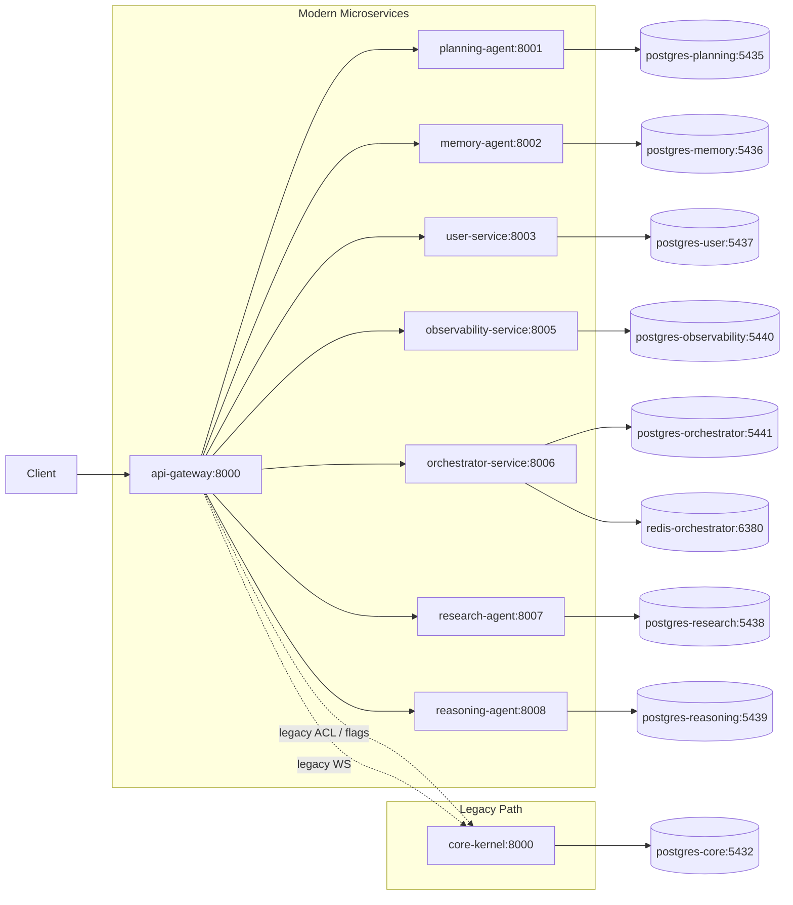

# 1) Executive Summary (max 20 lines)
- **Current state:** The repository runs a hybrid runtime: API Gateway and multiple microservices are active in `docker-compose.yml`, while `core-kernel` is still present (behind `profiles: ["legacy"]`) and a full legacy stack remains in `docker-compose.legacy.yml`.
- **What blocks 100% microservices:** The gateway still contains hard-wired legacy routing and target URL (`CORE_KERNEL_URL`) with explicit legacy forwarding paths for HTTP and WebSocket traffic, meaning the monolith remains an operational dependency in production cutover logic.
- **Most critical blocker:** Legacy traffic control is concentrated in the API Gateway routing layer, not removed from runtime behavior. This creates split-brain routing risk (new service vs legacy path) and keeps emergency rollback coupled to monolith reachability.
- **Shortest safe path:** Keep Strangler pattern, but enforce quantitative gates: (1) legacy route count to zero, (2) zero `core-kernel` traffic for sustained period, (3) remove all gateway-to-core legacy proxies, (4) move emergency legacy to non-default runtime profile only, (5) remove `core-kernel` from default runtime composition.
- **Safety posture required:** feature flags per route family, CDC/contract verification in CI, trace propagation conformance tests, reversible rollout runbooks, and explicit stop-ship checks.
- **Key reality gap:** multiple docs claim “100% API-First/microservices”, but runtime and gateway code still preserve legacy route wiring and monolith fallback.

# 2) Definition of “100% Microservices” (Measurable)

## Checklist with PASS/FAIL criteria

| Gate | PASS condition | FAIL condition | How to measure |
|---|---|---|---|
| core-kernel production traffic = 0 for N days | `legacy_request_total` and `legacy_ws_sessions_total` remain `0` for **30 consecutive days** | Any non-zero legacy request/session in window | Gateway logs/metrics from legacy ACL and WS proxies; dashboard query grouped by `legacy_flag` |
| no gateway routes proxy to core-kernel | No route handler calls `legacy_acl.forward_http()` or `legacy_acl.websocket_target()` in active routing table | Any active route still targets `CORE_KERNEL_URL` | Static scan of `microservices/api_gateway/main.py` + route registry (`config/routes_registry.json`) |
| independent deployability per service | Any service can build/deploy/rollback without rebuilding monolith image or sibling service image | Deployment pipeline requires monolith runtime for core user flows | CI pipelines + compose profiles; test staged deploy of one service while others unchanged |
| database-per-service enforcement | Each service has isolated DB URL/credentials and schema ownership; no shared credentials across services | Shared DB credentials or service reading another service DB | Compose env vars + secret inventory + DB grants audit |
| no cross-service imports | Boundary checker returns zero violations | Any import from sibling service or `app` in microservice code | `python tools/ci/check_import_boundaries.py` |
| contract gates enforced for every public API | Consumer + provider checks required in merge gate | Contracts optional or bypassed | CI job must fail on contract drift (`.github/workflows/ci.yml`) |
| tracing propagation verified end-to-end | `traceparent` present ingress→gateway→service and correlated logs include trace IDs | Missing or regenerated context breaks chain | Integration test asserts header continuity + log correlation fields |

## Stop-Ship list (release blockers)
1. Any route in gateway can still route to `CORE_KERNEL_URL` in normal production profile.
2. Any production flow requires enabling `ROUTE_*_USE_LEGACY=true` to function.
3. Legacy traffic ratio > 0% after declared cutover date.
4. Any service shares DB credentials with another business service.
5. Contract verification step is non-blocking (`|| true`) for changed public API contracts.
6. Trace propagation conformance test fails on critical user journeys.

# 3) Root Cause #1 (single most dangerous architectural residue)

## Title (10–14 words)
**Gateway-level legacy fallback keeps monolith as hidden production control plane dependency**

## Evidence Pack
1. `docker-compose.yml` still defines `core-kernel` service (legacy profile) and wires `DATABASE_URL` to `postgres-core`, proving monolith remains runnable in default stack file. Identifier: `services.core-kernel`, `profiles: ["legacy"]`.
2. `docker-compose.legacy.yml` keeps a full monolith stack and binds `core-kernel` directly on host `8000:8000`. Identifier: `services.core-kernel.ports`.
3. Gateway config has explicit `CORE_KERNEL_URL` default. Identifier: `microservices/api_gateway/config.py::Settings.CORE_KERNEL_URL`.
4. Gateway constructs `LegacyACL` at module load. Identifier: `microservices/api_gateway/main.py::legacy_acl = LegacyACL(proxy_handler)`.
5. `/admin/ai-config` route can still forward to monolith via flag. Identifier: `main.py::admin_ai_config_proxy`, `ROUTE_ADMIN_AI_CONFIG_USE_LEGACY`.
6. `/api/chat/{path}` route includes legacy fallback branch to core-kernel. Identifier: `main.py::chat_http_proxy`, `ROUTE_CHAT_USE_LEGACY`.
7. `/v1/content/{path}` route includes legacy fallback branch. Identifier: `main.py::content_proxy`, `ROUTE_CONTENT_USE_LEGACY`.
8. `/api/v1/data-mesh/{path}` route includes legacy fallback branch. Identifier: `main.py::datamesh_proxy`, `ROUTE_DATAMESH_USE_LEGACY`.
9. `/system/{path}` route includes legacy fallback branch. Identifier: `main.py::system_proxy`, `ROUTE_SYSTEM_USE_LEGACY`.
10. **WebSocket chat routes always target legacy core-kernel** (no flag guard). Identifier: `main.py::chat_ws_proxy`, `main.py::admin_chat_ws_proxy`, call to `legacy_acl.websocket_target(...)`.
11. Legacy ACL explicitly marks requests and forwards using `settings.CORE_KERNEL_URL`. Identifier: `legacy_acl/adapter.py::forward_http`.
12. Route registry still lists legacy-owned routes and legacy fallbacks with sunset dates. Identifier: `config/routes_registry.json` entries for `/admin/ai-config`, `/api/chat/ws`, `/admin/api/chat/ws`.
13. Baseline file allows up to legacy route count `7`, not zero. Identifier: `config/legacy_routes_baseline.txt`.
14. Fitness check enforces only “non-increasing” legacy route count, allowing persistence. Identifier: `scripts/fitness/check_legacy_routes_monotonic.py`.
15. Docs claim 100% API-first while runtime retains legacy routes. Identifier: `docs/API_FIRST_PROOF.md`, `docs/API_FIRST_ARCHITECTURE.md` vs gateway legacy branches.
16. Deployment docs reference `docker-compose.microservices.yml` (missing file), indicating control-plane documentation drift. Identifier: `docs/MICROSERVICES_DEPLOYMENT_GUIDE.md` + repository file absence.
17. Makefile still provides direct monolith runtime commands (`uvicorn app.main:app`). Identifier: `Makefile::run/dev/debug`.
18. Devcontainer compose boots monolith `web` service directly on port 8000 (non-gateway topology). Identifier: `.devcontainer/docker-compose.host.yml::services.web`.

## Risk scoring
- **Impact: 5/5** — core traffic path ambiguity can break critical customer/admin chat and control routes under cutover or rollback.
- **Likelihood: 4/5** — fallback code is active and route flags exist; operational teams can enable legacy during incidents, and WS routes are already hard-wired to legacy.
- **Blast radius: 5/5** — gateway is central entrypoint, so incorrect fallback behavior affects all user traffic domains and incident response paths.

## Failure stories
### (a) Outage story
A deploy introduces regression in orchestrator chat endpoint. Because WS chat still targets legacy core-kernel by design, HTTP chat may hit orchestrator while WS hits legacy, causing session split, inconsistent state, and cascading 5xx/retries. Result: user-visible chat instability and incident complexity due to dual backends.

### (b) Security pivot story
During emergency re-enable, ops sets legacy flags and `CORE_KERNEL_URL`. If legacy auth hardening differs from microservices token model, attacker can probe legacy endpoints behind gateway using older assumptions, pivoting through a weaker monolith surface while appearing as normal gateway traffic.

## Why solving this unlocks the rest
Removing gateway-to-legacy control paths eliminates the final runtime dependency loop, allowing strict microservice deploy/rollback isolation, real zero-legacy traffic SLOs, and decommission of monolith infrastructure without hidden traffic regressions.

# 4) Reality Map (Runtime Truth)

## Runtime topology (derived from compose + scripts)
- Primary runtime file is `docker-compose.yml` with API Gateway on port 8000 and multiple microservices.
- `core-kernel` is still present in `docker-compose.yml` but profile-gated (`legacy`), and fully active in `docker-compose.legacy.yml`.
- Dedicated Postgres instances exist per service (`postgres-planning`, `postgres-memory`, `postgres-user`, etc.) plus `postgres-core` for monolith.
- Orchestrator uses dedicated Redis (`redis-orchestrator`).
- Devcontainer runtime diverges: monolith-only `web` service on port 8000.

## Mermaid diagram


## Component table

| Component | Owner (in repo intent) | Data store | Public contract | Critical dependencies |
|---|---|---|---|---|
| API Gateway | Platform/Gateway | None | FastAPI routes in `microservices/api_gateway/main.py` + gateway contracts | All downstream service URLs + legacy ACL |
| planning-agent | Planning domain | `postgres-planning` | `/api/v1/planning/*` via gateway | Postgres Planning |
| memory-agent | Memory domain | `postgres-memory` | `/api/v1/memory/*` via gateway | Postgres Memory |
| user-service | Identity domain | `postgres-user` | `/api/v1/users/*`, `/api/v1/auth/*` via gateway | Postgres User, JWT secret |
| orchestrator-service | Orchestration domain | `postgres-orchestrator`, Redis | `/api/v1/overmind/*`, `/api/v1/missions*` via gateway | Planning/Memory/User/Research/Reasoning URLs |
| observability-service | Observability domain | `postgres-observability` | `/api/v1/observability/*` and data-mesh target | Postgres Observability |
| research-agent | Content/Research domain | `postgres-research` | `/api/v1/research/*`, content target | Postgres Research |
| reasoning-agent | Reasoning domain | `postgres-reasoning` | `/api/v1/reasoning/*` | Postgres Reasoning |
| core-kernel (legacy) | Legacy monolith | `postgres-core` | legacy routes + WS fallback | Monolith app runtime + gateway legacy ACL |

# 5) Bounded Contexts & Service Boundaries (DDD-informed)

## Identified bounded contexts
- **Identity & Access:** `user-service`
- **Planning:** `planning-agent`
- **Memory:** `memory-agent`
- **Orchestration/Control Plane:** `orchestrator-service`
- **Content/Research:** `research-agent`
- **Reasoning:** `reasoning-agent`
- **Observability/Data-mesh telemetry:** `observability-service`
- **Conversation (currently split):** partially orchestrator + residual legacy chat WS/HTTP

## Per-service boundary blueprint
1. **Identity Service**
   - Ownership: auth/users/admin identity controls
   - API: `/api/v1/users/*`, `/api/v1/auth/*`, `/admin/*` (rewritten)
   - Data ownership: user DB/schema only
   - Events: `identity.user.created`, `identity.role.updated`
   - SLO: 99.95% auth path availability
   - Failure isolation: local cache for token introspection, degraded mode denies privileged ops

2. **Conversation Service (target extraction)**
   - Ownership: chat HTTP + WebSocket state/session
   - API: `/api/chat/*`, `/api/chat/ws`, `/admin/api/chat/ws`
   - Data ownership: conversation session store (new dedicated DB/Redis namespace)
   - Events: `conversation.message.received`, `conversation.session.closed`
   - SLO: p95 < 300ms HTTP, WS connection success > 99.9%
   - Isolation: circuit breaker + backpressure on WS fanout

3. **Content Service (target extraction from research fallback)**
   - Ownership: `/v1/content/*` canonical behavior
   - Data ownership: content metadata/index DB
   - Events: `content.indexed`, `content.updated`
   - SLO: p95 < 400ms read APIs
   - Isolation: search fallback cache/read replicas

4. **Orchestration Service**
   - Ownership: mission workflow & delegation
   - Data ownership: orchestrator DB + Redis queue/cache
   - Events: `mission.started`, `mission.completed`, `mission.failed`
   - SLO: workflow success rate > 99%
   - Isolation: retriable task envelopes + dead-letter queue

5. **Observability Service**
   - Ownership: telemetry ingestion and data-mesh APIs
   - Data ownership: observability DB only
   - Events: `telemetry.ingested`
   - SLO: ingest success > 99.9%
   - Isolation: bulkhead ingestion worker pools

## Extraction Map (monolith module → target service)
- `app/api/routers/customer_chat.py`, `app/api/routers/admin.py` chat endpoints → **Conversation Service**.
- `app/api/routers/content.py` → **Content Service**.
- `app/api/routers/data_mesh.py`, `app/api/routers/observability.py` residuals → **Observability Service**.
- `app/api/routers/system/*` operational/system concerns → **Orchestrator/System Service split**.
- `app/api/routers/ums.py`, `app/api/routers/security.py` legacy identity paths → **User Service**.

# 6) Data Ownership & Consistency Blueprint

## Target database-per-service trajectory
- Keep one database (or isolated schema+credentials) per service with strict grant boundaries.
- Remove `postgres-core` from default production profile once legacy traffic reaches zero.
- Enforce secret scopes: each service gets only its own DB credentials; gateway gets none.

## Cross-service business flows + saga patterns (design)
1. **User onboarding saga**
   - Steps: Identity create → Memory profile bootstrap → Observability audit event.
   - Compensation: if memory bootstrap fails, mark user `provisioning_pending`, retry async.

2. **Conversation mission saga**
   - Steps: Conversation intake → Orchestrator mission create → Planning/Reasoning/Research fanout → response publish.
   - Compensation: if downstream failure, publish `conversation.response.degraded` with partial answer and retry token.

3. **Content ingestion saga**
   - Steps: Content submit → Research index → Observability metrics emit.
   - Compensation: if indexing fails, place into retry queue with idempotency key.

## Event/outbox + idempotency strategy (design)
- Outbox per service table with transactional write (business state + outbox record).
- Relay publishes events to broker with dedup key = `{event_type}:{aggregate_id}:{version}`.
- Consumers store processed message IDs for idempotent apply.
- Retry policy: exponential backoff + DLQ with operator replay runbook.

## Shared state risks and elimination
- Risk: shared secrets (`SECRET_KEY`) reused across services for JWT trust.
- Risk: gateway fallback to monolith for mixed route families causes dual-write/dual-read semantics.
- Elimination: per-service asymmetric keys (JWKS), remove fallback branches, explicit event contracts instead of implicit shared state assumptions.

# 7) Strangler Fig Migration Plan (4 phases with exit criteria)

## PHASE 0: Stabilize & isolate (ACL, route registry, telemetry labels)
### Goals
- Freeze legacy surface area and make it fully observable.
### Steps
1. Lock `config/routes_registry.json` as source for all public gateway routes.
2. Add mandatory `legacy_flag` labeling in every gateway access log/metric.
3. Keep `CORE_KERNEL_URL` usage restricted to ACL module only.
4. Create release dashboard: legacy ratio, route-level error, p95 latency.
### Exit Criteria (quantitative)
- 100% gateway routes represented in route registry.
- Legacy route ratio dashboard live; 7-day baseline collected.
- CI checks pass for ACL isolation, route monotonicity, import boundaries.
### Rollback plan
- None needed (observability/governance-only).
### Risks & mitigations
- Risk: unknown dark traffic. Mitigation: mandatory access logs + route ID.
### No-regret governance changes
- Route owner required per route; sunset date required for any legacy route.

## PHASE 1: Extract highest-traffic legacy surfaces (chat/content) behind contracts
### Goals
- Remove legacy dependency for chat HTTP/WS and content APIs.
### Steps
1. Introduce dedicated Conversation service contract (HTTP + WS).
2. Move `/api/chat/ws` and `/admin/api/chat/ws` off monolith target.
3. Complete content behavior parity in target service.
4. Run CDC verification for top consumers before toggling default.
### Exit Criteria
- Chat HTTP + WS legacy traffic = 0 for 14 days.
- Content legacy traffic = 0 for 14 days.
- `ROUTE_CHAT_USE_LEGACY` and `ROUTE_CONTENT_USE_LEGACY` removed or permanently false in prod config.
### Rollback plan
- Time-boxed re-enable flag (max 24h) with incident ticket and automatic expiry.
### Risks & mitigations
- Risk: WS semantics mismatch. Mitigation: protocol conformance tests + canary users.
### No-regret governance changes
- No new WebSocket endpoint accepted without versioned contract + CDC test.

## PHASE 2: Drain remaining legacy families (system/admin/data-mesh)
### Goals
- Finish migration of admin/system/data-mesh paths.
### Steps
1. Move `/admin/ai-config` to user-service only.
2. Move `/system/*` to orchestrator/system service boundary.
3. Move `/api/v1/data-mesh/*` fully to observability service.
4. Remove legacy fallback flags for these families.
### Exit Criteria
- Legacy route count in registry reaches **0**.
- `legacy_routes_baseline.txt` updated from `7` policy to `0` hard requirement.
### Rollback plan
- Route-family rollback only via emergency profile and explicit route ACL file.
### Risks & mitigations
- Risk: hidden admin workflows in monolith. Mitigation: synthetic admin journey tests pre-cutover.
### No-regret governance changes
- Stop accepting `legacy_fallback` field in route registry for new routes.

## PHASE 3: Retire core-kernel from default runtime
### Goals
- Decommission monolith from normal operations.
### Steps
1. Remove `core-kernel` from `docker-compose.yml` default runtime profile.
2. Keep emergency legacy stack in separate, non-default, time-boxed runbook only.
3. Remove gateway legacy ACL code paths from active runtime.
4. Remove `postgres-core` from default platform deployment.
### Exit Criteria
- `core-kernel` absent from default compose runtime and prod manifests.
- Zero legacy traffic for 30 consecutive days.
- DR exercise validates rollback without default monolith dependency.
### Rollback plan
- Emergency legacy profile can be enabled for <=24h with executive approval and expiry automation.
### Risks & mitigations
- Risk: rollback panic reintroduces long-lived legacy. Mitigation: TTL-enforced feature flags and postmortem gate.
### No-regret governance changes
- Change management policy: any legacy re-enable must include auto-expiry and mandatory incident report.

# 8) Governance: Architectural Fitness Functions (regression prevention)

## Fitness functions and CI implementation
1. **No `CORE_KERNEL_URL` usage outside legacy ACL module**
   - Command: `python scripts/fitness/check_core_kernel_acl.py`
2. **Legacy routes count strictly non-increasing (target eventually zero)**
   - Current command: `python scripts/fitness/check_legacy_routes_monotonic.py`
   - Governance hardening: change policy threshold to zero after Phase 2.
3. **Port consistency across docs/Makefile/compose**
   - Command: `python scripts/fitness/check_ports_consistency.py`
4. **No cross-service imports**
   - Commands: `python tools/ci/check_import_boundaries.py` and `python scripts/fitness/check_no_cross_service_imports.py`
5. **No cross-service DB references**
   - Add script: parse env vars and DB grants; fail if a service references another service DB host/schema.
   - Proposed command: `python scripts/fitness/check_db_ownership.py`
6. **Contract verification required on merge**
   - Existing: `python scripts/fitness/check_contracts_verified.py` + spectral in CI.
   - Hardening: remove `|| true` from spectral lint steps in `.github/workflows/ci.yml`.
7. **Trace propagation conformance tests**
   - Add integration test suite asserting `traceparent` continuity gateway→service and log fields.
   - Proposed command: `pytest -q tests/integration/test_trace_propagation.py`

## Exact command set to run in pipeline
```bash
python scripts/fitness/check_core_kernel_acl.py
python scripts/fitness/check_legacy_routes_monotonic.py
python scripts/fitness/check_ports_consistency.py
python tools/ci/check_import_boundaries.py
python scripts/fitness/check_contracts_verified.py
python scripts/fitness/check_core_kernel_env_profile.py
# proposed additions
python scripts/fitness/check_db_ownership.py
pytest -q tests/integration/test_trace_propagation.py
```

# 9) Contracts & Compatibility Strategy

## CDC plan (Pact or equivalent)
- Consumers (frontend, orchestrator clients, admin clients) publish expected interactions for chat/content/system/admin/data-mesh.
- Providers (conversation/content/orchestrator/user/observability services) verify in CI before merge.
- Release gate: provider deploy blocked if consumer contracts fail.

## Versioning rules
- **HTTP:** `/api/v{n}/...` mandatory for public routes.
- **WebSocket:** version in path or subprotocol (e.g., `/api/chat/ws?v=2` or `Sec-WebSocket-Protocol: chat.v2`).
- **Events:** semantic event version suffix, e.g., `conversation.message.created.v1`.

## Deprecation/sunset policy for legacy routes
- Every deprecated route must include owner + sunset date + migration target in route registry.
- Sunset missed => automatic stop-ship unless executive exception documented.

## Rule: no new unversioned public APIs
- CI lint on route declarations to reject new public routes missing version segment.

# 10) Observability & Operations Readiness

## W3C traceparent propagation rules
- If inbound `traceparent` exists, preserve it and forward unchanged.
- If absent, gateway generates valid W3C value and forwards it.
- All downstream services must log and return correlation IDs.

## Required log correlation fields
- `trace_id`, `span_id`, `service`, `route`, `legacy_flag`, `legacy_route_id`, `request_id`, `status_code`, `duration_ms`.

## Required dashboards
1. Legacy traffic ratio by route family (`chat/content/system/admin/data-mesh`).
2. Error budget burn per service.
3. Call-chain depth and fanout failures from orchestrator.
4. p95/p99 latency and timeout rates.

## Runbooks
- **Cutover runbook:** enable new route target, monitor 30/60/120 min checkpoints.
- **Rollback runbook:** flag rollback with TTL, incident channel, approval chain.
- **Incident response:** classify by route family + service owner + blast radius.
- **Emergency legacy enable:** only via legacy compose profile, auto-expiry in <=24h.

# 11) Delivery Backlog (Top 25 tasks)

Ordered by risk reduction / ROI.

1. **Eliminate hard-wired legacy WS routing** — Scope: move `/api/chat/ws` + `/admin/api/chat/ws` to microservice target; **DoD:** 0 WS traffic to core for 14 days; **Deps:** conversation WS contract; **Rollback:** TTL flag. **[Critical Path]**
2. **Conversation service contract finalization (HTTP+WS)** — DoD: CDC green for all consumers; Deps: #1; rollback via contract version pin. **[Critical Path]**
3. **Content parity certification suite** — DoD: behavior parity tests pass; rollback route toggle.
4. **Set legacy route baseline target to 0** — DoD: CI fails if any `legacy_flag=true`; deps: #1-#3.
5. **Remove `/admin/ai-config` legacy branch** — DoD: no `ROUTE_ADMIN_AI_CONFIG_USE_LEGACY` in prod env.
6. **Drain `/system/*` legacy branch** — DoD: 0 legacy calls for 14 days.
7. **Drain `/api/v1/data-mesh/*` legacy branch** — DoD: all served by observability service.
8. **Remove legacy ACL from active gateway path** — DoD: no runtime callsites.
9. **Remove `CORE_KERNEL_URL` from gateway config defaults** — DoD: only emergency profile references remain.
10. **Create DB ownership fitness script** — DoD: CI blocks cross-service DB host/schema.
11. **Introduce strict spectral blocking (remove `|| true`)** — DoD: contract lint failures block merge.
12. **Add provider verification stage (CDC)** — DoD: mandatory pass before deploy.
13. **Trace propagation integration tests** — DoD: gateway→all critical services verified.
14. **Legacy traffic dashboard GA** — DoD: SLO widgets + alerting thresholds live.
15. **Feature flag TTL enforcement service/policy** — DoD: expired rollback flags auto-disabled.
16. **Run synthetic admin journey tests** — DoD: pre-release admin path confidence.
17. **Run synthetic customer chat journey tests** — DoD: pre-release chat confidence.
18. **Prod canary for route-family cutovers** — DoD: 5%→25%→100% progressive rollout policy.
19. **Deprecation governance bot for route sunset dates** — DoD: PR/release warnings and blockers.
20. **Secrets segmentation for service JWT trust (JWKS)** — DoD: per-service key separation.
21. **Remove monolith run targets from default Makefile workflows** — DoD: primary dev/prod path is gateway+services.
22. **Align devcontainer to gateway topology** — DoD: dev runtime mirrors production service graph.
23. **Resolve docs-runtime drift (compose filename/ports)** — DoD: docs validated against actual compose.
24. **Execute 30-day zero-legacy burn-in** — DoD: no legacy traffic alarms in window. **[Critical Path]**
25. **Decommission `core-kernel` from default runtime profile** — DoD: absent from default compose + deployment manifests, emergency path time-boxed only. **[Critical Path]**

# 12) Appendix (Evidence Index)

## Files inspected
- `docker-compose.yml`
- `docker-compose.legacy.yml`
- `.devcontainer/docker-compose.host.yml`
- `microservices/api_gateway/main.py`
- `microservices/api_gateway/config.py`
- `microservices/api_gateway/legacy_acl/adapter.py`
- `microservices/api_gateway/middleware.py`
- `microservices/api_gateway/security.py`
- `config/routes_registry.json`
- `config/legacy_routes_baseline.txt`
- `scripts/fitness/check_core_kernel_acl.py`
- `scripts/fitness/check_legacy_routes_monotonic.py`
- `scripts/fitness/check_core_kernel_env_profile.py`
- `scripts/fitness/check_ports_consistency.py`
- `scripts/fitness/check_contracts_verified.py`
- `tools/ci/check_import_boundaries.py`
- `.github/workflows/ci.yml`
- `tests/contracts/test_gateway_routing_contracts.py`
- `docs/contracts/consumer/gateway_route_contracts.json`
- `docs/MICROSERVICES_DEPLOYMENT_GUIDE.md`
- `docs/API_FIRST_ARCHITECTURE.md`
- `docs/API_FIRST_PROOF.md`
- `docs/reports/API_FIRST_PLAN_VERIFICATION.md`
- `Makefile`
- `app/api/routers/customer_chat.py`
- `app/api/routers/admin.py`
- `app/api/routers/content.py`
- `app/api/routers/data_mesh.py`
- `app/api/routers/system/__init__.py`
- `app/api/routers/ums.py`
- `app/api/routers/security.py`
- `docs/contracts/BOUNDED_CONTEXTS.md`
- `microservices/README.md`
- `scripts/validate_compose_isolation.py`
- `docs/architecture/LEGACY_EMERGENCY_RUNBOOK.md`
- `docs/architecture/PORTS_SOURCE_OF_TRUTH.json`

## Key searches performed (terminal patterns)
- `rg -n "CORE_KERNEL_URL|core-kernel|LEGACY|proxy|docker-compose|orchestrator|gateway|port|JWT|SERVICE_TOKEN" --glob '!*.lock'`
- `rg -n "CORE_KERNEL_URL|legacy|proxy|APIRouter|include_router|core-kernel|LEGACY" microservices/api_gateway app/api app/core scripts Makefile .devcontainer/docker-compose.host.yml docs/MICROSERVICES_DEPLOYMENT_GUIDE.md docs/API_FIRST_ARCHITECTURE.md`
- `rg -n "100%|core-kernel|legacy|default runtime|removed|api-gateway|port 8000|profiles: \[\"legacy\"\]|database-per-service|no shared" README.md docs/MICROSERVICES_DEPLOYMENT_GUIDE.md docs/API_FIRST_ARCHITECTURE.md docs/API_FIRST_PROOF.md docs/reports/API_FIRST_PLAN_VERIFICATION.md .devcontainer/docker-compose.host.yml Makefile`
- `rg -n "check_core_kernel_acl|check_legacy_routes_monotonic|check_ports_consistency|check_import_boundaries|contract|pact|spectral|trace" .github/workflows Makefile scripts`
- `rg -n "DATABASE_URL|SERVICE_TOKEN|Authorization|jwt|verify|traceparent|health|Depends" microservices/*/main.py microservices/*/**/*.py`
- `rg -n "docker-compose.microservices.yml" -S`

## Summary of findings per directory
- `microservices/api_gateway/`: Active strangler logic still contains legacy fallbacks and hard-wired legacy WS targeting.
- `config/`: Route registry shows remaining legacy ownership/fallback; baseline policy is non-zero legacy tolerance.
- `scripts/fitness/`: Good foundational fitness checks exist, but some are monotonic rather than zero-enforcing.
- `docs/`: Significant drift—multiple “100% complete” claims and outdated compose filename/ports.
- `.github/workflows/`: Guardrails exist; contract lint is currently non-blocking in places due to `|| true`.
- `app/api/routers/`: Legacy monolith surfaces still define modules mapped to extracted service targets.
- runtime compose files: hybrid topology persists, with monolith still runnable and operationally recoverable.
