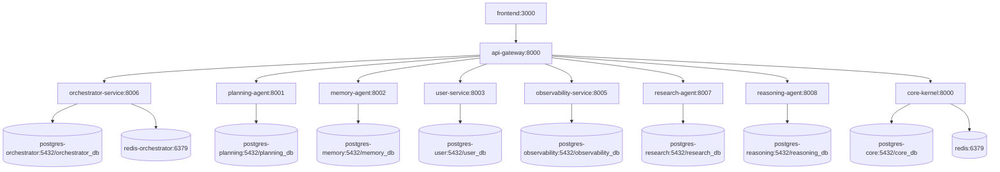

# 1. Executive Summary

This forensic scan confirms the repository is in a **hybrid state**: real microservices exist, but they are still coupled to a live legacy core at runtime.
The single most dangerous residue is **Control-Plane Duality**: both `core-kernel` (monolith) and `api-gateway`+microservices are first-class runtime authorities for production traffic.
This is not a theoretical issue; it is wired in `docker-compose.yml`, gateway routing, and operational scripts.
The dual control plane amplifies blast radius, blocks independent deployability, and creates reliability/security ambiguity.
Strangler work has started (explicit legacy route markers), but governance is incomplete (port drift, route drift, stale configs).
Data ownership is partially improved (dedicated Postgres instances per service), yet orchestration remains synchronous and tightly chained in critical flows.
The migration blueprint below is derived from Root Cause #1 and uses:
- **Strangler Fig** for incremental replacement
- **ACL (Anti-Corruption Layer)** to isolate legacy contracts
- **DB-per-service trajectory + Saga compensations** for consistency
- **Fitness Functions** to continuously prevent regressions
- **Contract testing + trace propagation** to keep rollout safe

---

# 2. Monolith Residue Root Cause #1 (single most dangerous)

## Definition

**Root Cause #1: Control-Plane Duality (Split Authority Between Legacy Core and Microservices).**
The platform currently operates two competing system brains: (a) `core-kernel` monolith still running and receiving gateway-routed production traffic on legacy paths, and (b) new API Gateway + service mesh-style microservices for modern paths. This creates architectural ambiguity over who owns behavior, availability, security policy, and deploy cadence.

## Evidence Pack (repo-backed)

1. `docker-compose.yml` includes `core-kernel` as an active runtime service (not archival), with real DB dependency and internal exposure (`expose: 8000`).
2. `docker-compose.yml` configures `api-gateway` with `CORE_KERNEL_URL=http://core-kernel:8000`.
3. `microservices/api_gateway/config.py` has a first-class `CORE_KERNEL_URL` setting.
4. `microservices/api_gateway/main.py` explicitly labels **LEGACY MONOLITH ROUTES** and forwards several routes to `settings.CORE_KERNEL_URL`.
5. `microservices/api_gateway/main.py::admin_ai_config_proxy` forwards `/admin/ai-config` to monolith (`api/v1/admin/ai-config`).
6. `microservices/api_gateway/main.py::chat_http_proxy` forwards `/api/chat/*` to monolith.
7. `microservices/api_gateway/main.py::chat_ws_proxy` forwards WebSocket `/api/chat/ws` to monolith.
8. `microservices/api_gateway/main.py::admin_chat_ws_proxy` forwards WebSocket `/admin/api/chat/ws` to monolith.
9. `microservices/api_gateway/main.py::content_proxy` forwards `/v1/content/*` to monolith.
10. `microservices/api_gateway/main.py::datamesh_proxy` forwards `/api/v1/data-mesh/*` to monolith.
11. `microservices/api_gateway/main.py::system_proxy` forwards `/system/*` to monolith.
12. `Makefile` still offers `run/dev/debug` directly on monolith `app.main:app` at port 8000.
13. `docker-compose.legacy.yml` keeps standalone monolith deployment path with `core-kernel` as core backend.
14. `microservices/README.md` claims “100% API-First Microservices” while architecture still routes material traffic to monolith.
15. `microservices/README.md` advertises Orchestrator on `8004`, but runtime compose runs Orchestrator at `8006` (docs/reality drift).
16. `Makefile microservices-health` checks orchestrator on `localhost:8004`, conflicting with compose service port `8006`.
17. `microservices/api_gateway/app/config.py` contains stale/default internal gateway mapping where multiple service URLs default to `:8000`, indicating config split/entropy.
18. `microservices/orchestrator_service/src/core/config.py` still contains compatibility fallback to legacy service port `8000` in URL normalization tuples.

## Impact / Likelihood / Blast Radius

- **Impact: 5/5**
  - Ambiguous ownership of critical APIs, security enforcement, and outage recovery pathways.
- **Likelihood: 5/5**
  - Already active in current routing and startup scripts; no hypothetical precondition required.
- **Blast Radius: 5/5**
  - Affects gateway pathing, user/admin/chat traffic, incident response, and migration confidence.

**Composite risk = 125/125 (critical).**

## Two Failure Stories

### (a) Operational outage story
A gateway release changes auth/rate-limit behavior on microservice paths but legacy chat remains proxied to core-kernel. Core experiences elevated latency while orchestrator remains healthy. Platform health appears mixed/degraded; on-call executes recovery against wrong plane due to split ownership, increasing MTTR and causing cascading retries.

### (b) Security compromise story
A single shared JWT secret is used for gateway-issued service tokens and verified by multiple services. If one plane logs/exposes token material or secret handling is weaker in any path, attacker can mint trusted inter-service tokens (`sub=api-gateway`) and pivot across services because trust boundary is global, not per-service.

---

# 3. Reality Map (Runtime Topology)

## Mermaid Deployment Diagram

## Component Table

| Component | Runtime Unit | Owner (observed) | Data Store | Public Contract | Internal Dependencies |
|---|---|---|---|---|---|
| Frontend | Docker service `frontend` | Platform/UI | none | Next.js HTTP | `api-gateway` |
| API Gateway | Docker service `api-gateway` | Platform/API | none | FastAPI routes + proxy | All services + `core-kernel` |
| Core Kernel (legacy monolith) | Docker service `core-kernel` | Platform/Core | `postgres-core`, redis | FastAPI monolith | app kernel + legacy routers |
| Planning Agent | Docker service `planning-agent` | Domain/Planning | `postgres-planning` | FastAPI `/health`, planning APIs | JWT trust on shared secret |
| Memory Agent | Docker service `memory-agent` | Domain/Memory | `postgres-memory` | FastAPI `/health`, memory APIs | JWT trust on shared secret |
| User Service | Docker service `user-service` | Domain/Identity | `postgres-user` | FastAPI `/health`, auth/users APIs | JWT trust on shared secret |
| Observability Service | Docker service `observability-service` | Domain/Observability | `postgres-observability` | FastAPI `/health`, metrics APIs | JWT trust on shared secret |
| Orchestrator Service | Docker service `orchestrator-service` | Domain/Overmind | `postgres-orchestrator`, `redis-orchestrator` | FastAPI `/health`, missions | sync calls to other domain services |
| Research Agent | Docker service `research-agent` | Domain/Research | `postgres-research` | FastAPI `/health`, search APIs | called by gateway/orchestrator/reasoning |
| Reasoning Agent | Docker service `reasoning-agent` | Domain/Reasoning | `postgres-reasoning` | FastAPI `/health`, execute APIs | calls research agent in retriever |

---

# 4. Target Architecture v1 (Service Catalog + Context Map)

## Service Catalog v1

### 1) Edge Gateway Service
Capability: external ingress, authn/z, throttling, request shaping, routing.
Data ownership: none (stateless config + cache only).
Commands/events: `RequestReceived`, `RequestRouted`, `RequestRejected`.
API surface: `/api/v1/*` only; no direct domain logic.
SLO: p95 routing overhead < 30ms.
ACL: required for all remaining legacy endpoints during strangler.

### 2) Identity & Access Service (User Service)
Capability: users, roles, auth tokens, admin identity policies.
Data ownership: `user_db` only.
Commands/events: `UserRegistered`, `RoleGranted`, `SessionIssued`.
API surface: `/api/v1/users`, `/api/v1/auth`.
SLO: login p95 < 250ms.
ACL: translate legacy `/admin/*` auth semantics.

### 3) Planning Service
Capability: learning/mission plan generation and validation.
Data ownership: `planning_db` only.
Commands/events: `PlanDrafted`, `PlanValidated`, `PlanSelected`.
API surface: `/plans` family.
SLO: p95 < 400ms (excluding LLM external latency buckets).

### 4) Memory Service
Capability: memory persistence/retrieval/context enrichment.
Data ownership: `memory_db` only.
Commands/events: `MemoryStored`, `MemoryRetrieved`.
API surface: `/memories` family.
SLO: retrieval p95 < 200ms.

### 5) Orchestration Service
Capability: mission lifecycle, workflow coordination, policy-driven execution.
Data ownership: `orchestrator_db` + outbox.
Commands/events: `MissionCreated`, `TaskStarted`, `TaskFailed`, `MissionFinalized`.
API surface: `/missions`, `/overmind` command endpoints.
SLO: command acceptance p95 < 150ms; async completion tracked by events.

### 6) Reasoning Service
Capability: deep reasoning execution and structured answer generation.
Data ownership: `reasoning_db` only.
Commands/events: `ReasoningRequested`, `ReasoningCompleted`.
API surface: `/execute`, `/health`.
SLO: p95 < 1.5s for bounded tasks.

### 7) Research Service
Capability: retrieval/search/deep research orchestration.
Data ownership: `research_db` only.
Commands/events: `ResearchRequested`, `ResearchCompleted`.
API surface: research endpoints.
SLO: p95 < 1s (excluding external provider latency budgets).

### 8) Observability Service
Capability: telemetry ingestion, AIOps analytics, health snapshots.
Data ownership: `observability_db` only.
Commands/events: `TelemetryIngested`, `ForecastGenerated`, `AlertRaised`.
API surface: `/telemetry`, `/metrics`, `/forecast`, `/health`.
SLO: ingest p95 < 100ms.

### 9) Conversation Service (new extraction target)
Capability: chat HTTP/WS currently on core-kernel legacy paths.
Data ownership: dedicated conversation DB.
Commands/events: `ConversationStarted`, `MessageAppended`, `ConversationClosed`.
API surface: `/api/chat/*`, WS endpoints.
SLO: WS setup p95 < 200ms.
ACL: critical for transitioning monolith chat schemas/protocol to canonical contract.

### 10) Content Service (new extraction target)
Capability: `/v1/content/*` domain currently legacy.
Data ownership: dedicated content DB.
Commands/events: `ContentIndexed`, `ContentFetched`.
API surface: `/v1/content/*` (later versioned to `/api/v1/content/*`).
SLO: p95 < 300ms.
ACL: translates legacy payloads/query contracts.

## Context Map (upstream/downstream + ACL boundaries)

- Gateway (upstream to all public services).
- Orchestrator downstream of Planning/Memory/Research/Reasoning/User.
- Observability downstream from all services via telemetry/events.
- **ACL-1**: Gateway ↔ Core-Kernel legacy route adapter (temporary).
- **ACL-2**: New Conversation Service ↔ legacy chat models until full cutover.
- **ACL-3**: New Content Service ↔ legacy content representation.
- Identity is upstream authority for auth semantics; all services consume signed principal context (not shared secrets long-term).

---

# 5. Data & Consistency Strategy (DB-per-service trajectory + Saga designs)

## DB-per-service trajectory

- Current trajectory is partially correct at runtime compose level (distinct Postgres per service).
- Required hardening:
  1. Forbid any cross-service DB credentials in non-owner services.
  2. Introduce schema ownership manifest per service.
  3. Enforce outbox+event publication for cross-boundary state propagation.
  4. Decommission monolith DB dependencies route-by-route after ACL stabilization.

## Critical Flows (Saga-oriented)

### Flow 1: Mission creation and execution kickoff
1. Gateway receives mission command.
2. Orchestrator creates mission record (`PENDING`) + outbox event.
3. Orchestrator requests plan generation (Planning service).
4. If planning succeeds: mission transitions to `PLANNED`/`RUNNING`.
5. If planning fails: compensate by status=`FAILED`, publish failure event.
Consistency: eventual consistency between mission store and plan data.
Orchestration: orchestrated saga in Orchestrator.

### Flow 2: Mission task execution with research+reasoning
1. Orchestrator dispatches task to Research or Reasoning.
2. Service processes and returns result/refusal.
3. Orchestrator records task success/failure and updates mission aggregate.
4. Compensation on failure: mark task retry/failed; possibly re-plan.
Consistency: per-task atomic local commit, global eventual consistency.

### Flow 3: Authenticated admin operation routed from Gateway
1. Gateway validates user token.
2. Gateway mints service credential and calls User/Identity service.
3. Identity service mutates role/permission state.
4. Publish `RoleGranted/RoleRevoked` for downstream policy caches.
Compensation: if downstream propagation fails, retry from outbox; no distributed rollback of identity commit.

### Flow 4: Chat message processing (legacy -> new conversation service)
1. Gateway routes chat endpoint via ACL.
2. Conversation service persists canonical message.
3. Orchestrator invoked for AI response generation.
4. On orchestration failure: compensation emits partial failure event, preserves conversation timeline with failure marker.
Consistency: user-visible append-only log with eventual assistant completion.

### Flow 5: Telemetry ingest and alerting
1. Services emit telemetry/event.
2. Observability stores metrics.
3. AIOps computes forecast/alerts.
Compensation: if alert publication fails, retain pending alert outbox for replay.
Consistency: at-least-once ingestion + idempotent consumer keys.

---

# 6. Migration Strategy (Strangler Fig)

## Phase 0 — Stabilize control plane (no functional extraction yet)
- Goals:
  - Declare explicit ownership matrix per endpoint.
  - Build Gateway Legacy ACL module (single place) for monolith-routed endpoints.
  - Add route access telemetry labels: `legacy=true/false`.
- Exit criteria:
  - 100% of legacy-routed requests measurable by endpoint and volume.
  - No new direct `CORE_KERNEL_URL` route added outside ACL module.
- Rollback:
  - Toggle gateway routing table to previous map via config snapshot.

## Phase 1 — Extract Conversation + Content edges first
- Goals:
  - Introduce Conversation Service and Content Service contracts.
  - Route `/api/chat/*` and `/v1/content/*` through ACL translators to new services.
- Exit criteria:
  - ≥80% traffic on extracted endpoints served by new services with no severity-1 regressions.
  - Legacy fallback only for explicitly tagged corner-cases.
- Rollback:
  - Per-route feature flag to revert selected endpoints to legacy proxy.

## Phase 2 — Decommission legacy system/admin/data-mesh endpoints incrementally
- Goals:
  - Replace `/system/*`, `/api/v1/data-mesh/*`, remaining `/admin/*` legacy paths.
  - Lift required business logic into dedicated services.
- Exit criteria:
  - Zero production traffic to `CORE_KERNEL_URL` from gateway for 30 consecutive days.
- Rollback:
  - Controlled endpoint-level fallback with incident ticket + expiry timer.

## Phase 3 — Retire core-kernel as runtime dependency
- Goals:
  - Remove `core-kernel` from primary compose profile.
  - Keep archival/maintenance path isolated from production runtime.
- Exit criteria:
  - Independent deployability verified per service (build/deploy/rollback without monolith coupling).
  - Contract and SLO dashboards green for 2 release cycles.
- Rollback:
  - Emergency profile can re-enable legacy for short window, but guarded by architecture exception process.

## Where ACL is required and why
- Gateway Legacy ACL: prevents leaking monolith payload quirks into new service contracts.
- Conversation ACL: chat WS/HTTP protocol normalization.
- Content ACL: path/version normalization + schema adaptation.
- Admin ACL: temporary bridge for admin semantics while identity/policy APIs converge.

---

# 7. Evolutionary Governance (Fitness Functions + thresholds)

1. **No Cross-Service Imports**
   - Measure: static AST import scan.
   - Rule: service `A` cannot import `microservices.B.*`.
   - Build fail threshold: >0 violations.

2. **No Shared DB Access**
   - Measure: scan configs/migrations for foreign DB URLs/schemas.
   - Rule: each service can reference only its own DB alias/prefix.
   - Build fail threshold: >0 non-owner DB refs.

3. **Gateway Legacy Surface Shrink**
   - Measure: count routes targeting `CORE_KERNEL_URL`.
   - Rule: monotonically non-increasing after baseline.
   - Build fail threshold: any net increase.

4. **Contract Compatibility (CDC)**
   - Measure: provider verification against consumer pacts.
   - Rule: all published contracts must verify before merge.
   - Build fail threshold: any breaking consumer contract.

5. **Synchronous Call Chain Budget**
   - Measure: distributed trace depth + latency budgets.
   - Rule: critical path depth <= 3 synchronous hops for user-facing requests.
   - Build fail threshold: depth >3 or p95 > agreed budget.

6. **Security Invariants**
   - Measure: secret scanners + config policy checks.
   - Rule: no default weak secret in production manifests; enforce rotation metadata.
   - Build fail threshold: any hardcoded prod secret/default unsafe key.

7. **Port/Runtime Consistency Gate**
   - Measure: compare docs/Makefile/compose declared service ports.
   - Rule: single source of truth.
   - Build fail threshold: mismatch detected.

---

# 8. Contracts & Compatibility (CDC/Pact plan + versioning rules)

## CDC Strategy
- Consumers (Gateway, Orchestrator, frontend BFF adapters) publish pacts for each provider API they call.
- Providers (User/Planning/Memory/Research/Reasoning/Observability/Conversation/Content) verify pacts in CI.
- Broker tagging by environment (`dev`, `staging`, `prod`) and git SHA.

## Versioning Rules
1. Backward-compatible additions only in minor versions.
2. Breaking removals/shape changes require:
   - New versioned endpoint/event topic
   - Dual-run deprecation window
   - Consumer migration completion evidence
3. Event schemas versioned explicitly (`event_type@vN`) with schema registry checks.
4. Gateway cannot expose unversioned new public APIs.

---

# 9. Observability Baseline (trace propagation requirements)

1. Every external request gets/accepts `traceparent` and request-id.
2. Gateway must propagate trace context to all downstream service calls.
3. Service-to-service calls must preserve trace + span relationships.
4. Logs must include: `trace_id`, `span_id`, `service`, `route`, `legacy_flag`, `user_id_hash`.
5. For async events: include correlation id and causation id in metadata.
6. Dashboards:
   - Legacy-vs-modern traffic ratio
   - Error budget burn by service
   - Chain depth and p95 latency by route family

---

# 10. Backlog (Top 20 tasks)

1. **Create Gateway Legacy ACL module**  
   DoD: all `CORE_KERNEL_URL` forwarding centralized in one adapter layer.  
   Risk reduction: high (reduces routing entropy).  
   Dependencies: none.

2. **Inventory endpoint ownership registry**  
   DoD: machine-readable map endpoint→owner service published in repo.  
   Risk reduction: high.  
   Dependencies: Task 1.

3. **Add legacy traffic tagging (`legacy=true`)**  
   DoD: metrics per legacy endpoint visible in dashboard.  
   Risk reduction: high.  
   Dependencies: Task 1.

4. **Define Conversation Service contract (OpenAPI + WS spec)**  
   DoD: reviewed contract with backward-compat matrix.  
   Risk reduction: high.  
   Dependencies: Task 2.

5. **Define Content Service contract**  
   DoD: versioned contract with migration notes.  
   Risk reduction: medium-high.  
   Dependencies: Task 2.

6. **Implement Pact broker workflow in CI**  
   DoD: provider verification gate required on merge.  
   Risk reduction: high.  
   Dependencies: none.

7. **Add fitness check: no cross-service imports**  
   DoD: failing CI on violation.  
   Risk reduction: medium.  
   Dependencies: none.

8. **Add fitness check: no non-owner DB refs**  
   DoD: failing CI on DB boundary violation.  
   Risk reduction: high.  
   Dependencies: none.

9. **Add fitness check: legacy route count non-increasing**  
   DoD: CI reports baseline and blocks increases.  
   Risk reduction: high.  
   Dependencies: Task 1.

10. **Normalize port declarations across compose/docs/make**  
    DoD: orchestrator port inconsistency eliminated and validated automatically.  
    Risk reduction: medium-high.  
    Dependencies: Task 2.

11. **Introduce per-service signing keys (or mTLS) plan**  
    DoD: design approved replacing global shared JWT secret model.  
    Risk reduction: critical security.  
    Dependencies: identity architecture review.

12. **Implement key rotation readiness checks**  
    DoD: rotation drill passes in staging.  
    Risk reduction: high.  
    Dependencies: Task 11.

13. **Conversation Service MVP behind feature flag**  
    DoD: `/api/chat/*` can route to new service for pilot tenants.  
    Risk reduction: high.  
    Dependencies: Task 4.

14. **Content Service MVP behind feature flag**  
    DoD: `/v1/content/*` pilot traffic served by new service.  
    Risk reduction: medium-high.  
    Dependencies: Task 5.

15. **Implement mission orchestration saga state machine docs+tests**  
    DoD: compensations defined for failure branches and tested.  
    Risk reduction: high.  
    Dependencies: orchestrator domain team.

16. **Outbox reliability hardening for orchestrator events**  
    DoD: retry/idempotency and dead-letter policy documented and tested.  
    Risk reduction: high.  
    Dependencies: Task 15.

17. **Trace propagation conformance tests**  
    DoD: automated tests assert trace headers across gateway→services path.  
    Risk reduction: medium-high.  
    Dependencies: observability baseline.

18. **Legacy route deprecation SLO policy**  
    DoD: each legacy route has owner, target service, sunset date.  
    Risk reduction: high governance.  
    Dependencies: Task 3.

19. **Cutover rehearsal playbooks (rollback validated)**  
    DoD: runbooks for Conversation and Content cutovers approved.  
    Risk reduction: high operational.  
    Dependencies: Tasks 13,14.

20. **Remove core-kernel from primary production profile**  
    DoD: production compose/profile no longer requires core-kernel in steady state.  
    Risk reduction: critical (eliminates root cause).  
    Dependencies: 1–19.

---

# 11. Appendix: Commands you ran + outputs summary (tree/rg/grep, dependency graph steps)

## Commands executed

1. `tree -L 4`  
   - Result: command unavailable in environment (`tree: command not found`).

2. `find . -maxdepth 4 -type d | sort`  
   - Used as structural fallback to map repository runtime-relevant directories.

3. `rg "import .*microservices|from microservices" -n`  
   - Confirmed widespread microservice package usage and test coverage targets.

4. `rg "ORCHESTRATOR|GATEWAY|SERVICE_TOKEN|JWT|SECRET|X-Service-Token" -n`  
   - Identified secret/JWT coupling and gateway/service-token usage surfaces.

5. `rg "docker-compose|compose" -n`  
   - Located runtime wiring references in compose, docs, scripts, and Makefile.

6. `rg --files -g '*compose*.yml' -g '*compose*.yaml'`  
   - Enumerated compose files used for runtime truth.

7. `sed -n '1,520p' docker-compose.yml` and `sed -n '1,260p' docker-compose.legacy.yml`  
   - Established actual deployment topology and coexistence of monolith + microservices.

8. `nl -ba microservices/api_gateway/main.py|config.py|security.py`  
   - Confirmed legacy route forwarding, control plane, and token model.

9. `nl -ba app/main.py` and `nl -ba app/kernel.py`  
   - Verified monolith entrypoint remains actively runnable.

10. `nl -ba microservices/README.md` and `nl -ba Makefile`  
    - Confirmed docs/ops drift (port mismatch, API claims vs runtime).

11. Python static scan for cross-service imports in `microservices/*`  
    - Result: zero direct `microservices.A -> microservices.B` import edges.

12. Python static scan for service URL references by service  
    - Confirmed orchestration/gateway synchronous dependency graph and fallback defaults.

## Dependency graph summary (from static wiring)

- Gateway → all services + core-kernel (legacy).
- Orchestrator → planning/memory/research/reasoning/user service URLs.
- Reasoning → research agent URL.
- Core-kernel remains a live downstream target from gateway on multiple route families.

