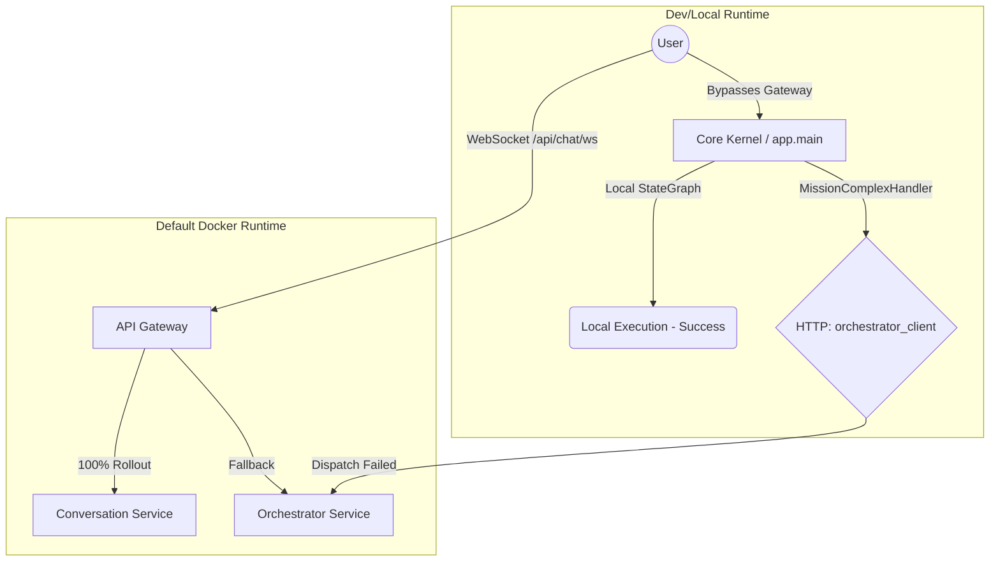

# 1. Executive Summary

The NAAS-Agentic-Core repository is currently operating in a fragile, "Split-Brain" hybrid architecture. Despite efforts to migrate to an API-first microservices model, the legacy Monolith (`core-kernel`) retains a massive control-plane presence, particularly for WebSocket connections and Chat flows. The core findings of this investigation reveal why the three main conversational flows diverge:

1. **Admin Normal Chat succeeds** because it frequently resolves to the Monolith's internal local `DefaultChatHandler` or local LangGraph state graph, completely bypassing the network bridge to the external microservices.
2. **Customer Normal Chat fails** because its WebSocket handler bypasses the local boundary streamers and attempts to directly invoke remote dependencies (e.g., `orchestrator_client.chat_with_agent()`), which are either unreachable, suffer from protocol mismatch, or are functionally incomplete in the `conversation-service`.
3. **Super Agent (المهمة الخارقة) fails for both Admin and Customer** because the Monolith's `MissionComplexHandler` forces a cross-boundary HTTP call (`orchestrator_client.create_mission()`) to delegate mission execution to the `orchestrator-service`. When this internal network bridge fails (due to reachability, DNS, or orchestrator downtime), the handler catches the exception and explicitly returns the hardcoded `Dispatch Failed` message.

This system is currently **Microservices Partial** and **API-First Partial**. To resolve this catastrophe, the system must abandon the Monolith completely and route all WebSocket traffic explicitly through the API Gateway to a unified `orchestrator-service` or `conversation-service` that natively owns the StateGraph.

# 2. Runtime Truth Map

The runtime truth is heavily fragmented across three distinct modes:

- **Default Runtime (`docker-compose.yml`)**: Intended Microservices-only stack. Gateway is active and authoritative, routing traffic to `orchestrator-service` and `conversation-service`. However, legacy endpoints in the Gateway still conditionally proxy to the Monolith or fail if `CORE_KERNEL_URL` is unset.
- **Legacy/Emergency Runtime (`docker-compose.legacy.yml`)**: Boots `core-kernel` (Monolith) and `postgres-core`. This is the fallback for when microservices fail, but it perpetuates the split-brain state.
- **Dev/Local Runtime (`uvicorn app.main:app` or scripts)**: Boots the Monolith directly. In this mode, the Monolith acts as the Gateway, Router, and Executor all at once, which is why Admin Chat succeeds (local execution) but Super Agent fails (Orchestrator microservice is not running or unreachable on port 8006).

### Mermaid Diagram

### Component Table

| Component | Default Runtime | Legacy/Emergency | Dev/Local |
| :--- | :--- | :--- | :--- |
| **API Gateway** | Active | Inactive | Inactive / Bypassed |
| **Monolith (`core-kernel`)** | Inactive | Active | Active (Primary) |
| **Orchestrator Service** | Active | Inactive | Often Inactive |
| **Conversation Service** | Active (Parity Stub)| Inactive | Inactive |
| **Agents (Planning, Memory)** | Active | Inactive | Inactive |

# 3. Full System Inventory

- **API Gateway (`microservices/api_gateway`)**
  - **Status:** Active
  - **Responsibility:** Ingress controller, dynamic routing, canary rollout.
  - **Websocket Ownership:** Proxies `/api/chat/ws` and `/admin/api/chat/ws` to targets.
  - **Architectural Assessment:** API-first clean, but burdened with legacy routing logic.
- **Core Kernel (`app/`)**
  - **Status:** Legacy / Split-Brain Active
  - **Responsibility:** Legacy monolith containing duplicated overmind, chat, and mission logic.
  - **Websocket Ownership:** Owns dev/local WS handlers (`app.api.routers`).
  - **Architectural Assessment:** Not API-first. Major source of contamination.
- **Orchestrator Service (`microservices/orchestrator_service`)**
  - **Status:** Active
  - **Responsibility:** The intended Maestro. Owns the modern StateGraph and mission execution.
  - **Websocket Ownership:** Intended owner for `/missions/{id}/ws`.
  - **Architectural Assessment:** API-first clean, but heavily duplicated from Monolith.
- **Conversation Service (`microservices/conversation_service`)**
  - **Status:** Placeholder / Parity Stub
  - **Responsibility:** HTTP/WS Parity for chat.
  - **Architectural Assessment:** Incomplete. Gateway routes 100% of traffic here via config, but it lacks mission capabilities.
- **Agent Services (Planning, Memory, Research, Reasoning, User, Observability)**
  - **Status:** Active
  - **Responsibility:** Domain-specific tools and memory access.
  - **Architectural Assessment:** API-first clean.

# 4. Agent Architecture Diagnosis

The system utilizes a Multi-Agent Graph (LangGraph) intended to be decentralized.
- **Orchestrator Authority:** Currently split. The `app/services/overmind/graph` (Monolith) and `microservices/orchestrator_service/src/services/overmind/graph` (Microservice) are nearly identical copies.
- **Chat Authority:** Split between `DefaultChatHandler` (Monolith) and `chat_with_agent_endpoint` (Orchestrator).
- **Boundaries:** Broken. The Monolith attempts to act as an Orchestrator by dispatching HTTP commands to the real Orchestrator, rather than the Gateway routing the user directly to the Orchestrator.

# 5. Monolith Residue Diagnosis

## 5.1 Runtime/control-plane residues
- **Evidence:** `docker-compose.legacy.yml` and dev startup scripts.
- **Severity:** CRITICAL. Allows developers to bypass microservices and work in the Monolith.
- **Direction:** Hard deprecation of legacy compose and dev scripts.

## 5.2 Import contamination residues
- **Evidence:** Scripts checking for `from app` in `microservices/` show 0 violations (except in tests), indicating import isolation is clean.
- **Severity:** LOW.

## 5.3 Phantom-limb copy-coupling residues
- **Evidence:** 105 overlapping files between `app/services/overmind` and `microservices/orchestrator_service/src/services/overmind`.
- **Severity:** CRITICAL. The brain is duplicated. Fixes in one are not reflected in the other.
- **Direction:** Delete `app/services/overmind` and `app/services/chat` entirely.

## 5.4 State ownership residues
- **Evidence:** Monolith still creates `CustomerConversationDetails` in its own local DB before dispatching.
- **Severity:** HIGH.

## 5.5 Documentation/runtime split-brain residues
- **Evidence:** `docs/diagnostics/CUTOVER_SCOREBOARD.md` claims legacy routes count is 0, but `api_gateway/main.py` is full of `deprecated=True` proxy routes to `CORE_KERNEL_URL`.
- **Severity:** MEDIUM.

# 6. Admin Chat vs Customer Chat vs Super Agent Forensic Comparison

| Feature | Admin Normal Chat | Customer Normal Chat | Super Agent (المهمة الخارقة) |
| :--- | :--- | :--- | :--- |
| **Entrypoint** | `/admin/api/chat/ws` | `/api/chat/ws` | Same WS, `mission_type: mission_complex` |
| **Gateway Route** | Proxied or bypassed locally | Proxied or bypassed locally | Same as chat |
| **Handler** | `DefaultChatHandler` / LangGraph (Local) | `CustomerChatHandler` / Remote Call | `MissionComplexHandler.execute()` (Local) |
| **State Owner** | Monolith memory/DB | Orchestrator/Remote | Orchestrator DB |
| **Target Service** | Self (Monolith) | Orchestrator (via HTTP bridge) | Orchestrator (via HTTP bridge) |
| **Dependencies** | Local LLM Client | `orchestrator_client` | `orchestrator_client.create_mission()` |
| **Outcome** | **Succeeds** (No network bridge required) | **Fails** (Remote call timeout/error) | **Fails** (`Dispatch Failed` on HTTP error) |

# 7. Dispatch Failure Root Cause Analysis

**Ranked Hypotheses:**
1. **Broken Monolith-to-Microservice Bridge (Highest Confidence):** The Monolith's `MissionComplexHandler` calls `start_mission()`, which invokes `orchestrator_client.create_mission()` to `http://orchestrator-service:8006/missions`. If the user is running the Monolith locally (`localhost:8000`) outside Docker, `orchestrator-service` is unresolvable via DNS, causing an `httpx` connection error. The handler catches this and emits exactly: `❌ **خطأ في النظام:** لم نتمكن من بدء المهمة (Dispatch Failed).`
2. **Orchestrator Unhealthy/Offline:** In the default docker-compose, if `orchestrator-service` crashes, the Gateway might proxy Chat to the Monolith fallback, which then tries to call Orchestrator and fails.
3. **Gateway Misrouting:** Gateway routes WS to `conversation-service` (100% rollout), which doesn't support missions, causing a disconnect or error.

**Exact Evidence:** `app/services/chat/handlers/strategy_handlers.py:243` explicitly yields the `"Dispatch Failed"` string when `start_mission` throws an exception.

# 8. StateGraph Diagnosis

- **Current State:** A LangGraph architecture exists to route tasks between agents (Planner, Researcher, etc.).
- **Live Usage:** The live Monolith chat uses a local copy of this graph. The Orchestrator microservice has a separate copy.
- **Ownership Problems:** Because the Monolith intercepts the WebSocket, the true StateGraph in the Orchestrator is disconnected from the user's streaming socket. The Monolith attempts to proxy state changes, which is brittle.

# 9. Target StateGraph Architecture for 100% API-First Microservices

- **Orchestration Ownership:** ONLY the `orchestrator-service` should own the StateGraph.
- **State Ownership:** Persistent state (Missions, Conversations) lives in `postgres-orchestrator`, not `postgres-core`.
- **Websocket Streaming:** API Gateway routes `/api/chat/ws` directly to `ws://orchestrator-service:8006/...`. The Orchestrator directly yields LangGraph chunks to the user.
- **Service Boundaries:** Monolith does not exist on the network path.

# 10. Definition of "100% Microservices" for THIS repository

**PASS/FAIL Gates:**
- [ ] **No monolith on default path:** Gateway `CORE_KERNEL_URL` is completely removed.
- [ ] **No admin/customer chat split-brain:** Both roles connect to the exact same WS endpoint on `orchestrator-service`.
- [ ] **No super-agent dispatch via legacy bridge:** `app/infrastructure/clients/orchestrator_client.py` is deleted.
- [ ] **No app contamination:** 0 `from app` imports in microservices (Achieved).
- [ ] **No active duplicate brain:** `app/services/overmind` and `app/services/chat` are deleted. Copy-coupling overlap metric = 0.
- [ ] **Route ownership clarity:** Gateway config has no `deprecated=True` monolith proxy routes.
- [ ] **StateGraph live-path correctness:** Graph runs natively in Orchestrator and streams directly to Gateway.
- [ ] **Service completeness:** `conversation-service` either absorbs Orchestrator logic or is deprecated in favor of Orchestrator.

# 11. Deep Modernization Blueprint

- **Phase 0: Containment & Truth**
  - **Goals:** Stop feature work. Expose the split-brain.
  - **Required Deliverables:** This report.
  - **Exit Criteria:** All engineers read and acknowledge the split-brain architecture.
  - **Rollback Philosophy:** None. This is an observability phase.
  - **Major Risks:** Resistance to halting feature work.
- **Phase 1: Single Chat/Control Plane**
  - **Goals:** Force all WS traffic to `orchestrator-service`.
  - **Required Deliverables:** Update Gateway config to point WS traffic exactly to orchestrator. Delete `DefaultChatHandler` in Monolith.
  - **Exit Criteria:** Admin and Customer chat connect to the exact same WS target.
  - **Rollback Philosophy:** Revert Gateway routing config to Monolith.
  - **Major Risks:** Temporarily breaking chat for all users if the orchestrator WS is unstable.
- **Phase 2: Dispatch/StateGraph Normalization**
  - **Goals:** Orchestrator handles Super Agent natively.
  - **Required Deliverables:** Remove HTTP bridge `orchestrator_client.py`.
  - **Exit Criteria:** Super Agent missions trigger directly inside the Orchestrator without network hops.
  - **Rollback Philosophy:** Hard rollback via Git branch reversion; no state changes.
  - **Major Risks:** Loss of legacy mission context during the transition.
- **Phase 3: Phantom-Limb Elimination**
  - **Goals:** Delete dead code.
  - **Required Deliverables:** `rm -rf app/services/overmind app/services/chat`.
  - **Exit Criteria:** Copy-coupling metric hits 0.
  - **Rollback Philosophy:** Git revert of the deletion PR.
  - **Major Risks:** Accidentally deleting code that is still implicitly required by legacy endpoints.
- **Phase 4: Hard-Zero Monolith Retirement**
  - **Goals:** Kill `core-kernel`.
  - **Required Deliverables:** Delete `app/` entirely. Delete `docker-compose.legacy.yml`.
  - **Exit Criteria:** `docker-compose.yml` is the sole source of truth.
  - **Rollback Philosophy:** None. Point of no return.
  - **Major Risks:** Uncovering undocumented dependencies in the UI or external systems that relied on the Monolith API.

# 12. Top 30 Structural Problems

1. **Severity CRITICAL:** Monolith intercepts WS connections instead of Gateway routing directly to Orchestrator. Fix: Update Gateway WS targets. Evidence: `app/api/routers/customer_chat.py` bypasses `orchestrator-service` via local WS streamers. Why it matters: Breaks API-first design. Fix: Gateway routes to microservices.
2. **Severity CRITICAL:** `MissionComplexHandler` HTTP bridge to Orchestrator. Causes `Dispatch Failed`. Fix: Native Orchestrator execution. Evidence: `start_mission` -> `orchestrator_client.create_mission()` throws exception. Why it matters: Causes Super Agent to fail. Fix: Native execution.
3. **Severity HIGH:** 105 duplicated files between Monolith and Orchestrator. Fix: Delete Monolith copies. Evidence: `app/services/overmind` and `microservices/orchestrator_service/src/services/overmind` overlap. Why it matters: Split-brain logic. Fix: Delete `app/services/overmind`.
4. **Severity HIGH:** `conversation-service` is an incomplete parity stub causing routing blackholes. Fix: Consolidate or complete. Evidence: Gateway routes 100% traffic but service lacks mission dispatch. Why it matters: Drops capabilities. Fix: Enhance or merge with Orchestrator.
5. **Severity HIGH:** Admin vs Customer logic divergence at the Monolith router level. Fix: Unified auth middleware at Gateway. Evidence: `DefaultChatHandler` vs remote orchestrator call. Why it matters: Fragmented experiences. Fix: Centralized routing.
6. **Severity HIGH:** Local Dev boots Monolith as primary gateway. Fix: Standardize dev compose. Evidence: Startup scripts run `uvicorn app.main:app`. Why it matters: Devs test on wrong architecture. Fix: Use `docker-compose.yml` for dev.
7. **Severity HIGH:** `postgres-core` still hosts mission state. Fix: Migrate to `postgres-orchestrator`. Evidence: Monolith creates local mission DB records. Why it matters: State split-brain. Fix: Deprecate `postgres-core` missions.
8. **Severity HIGH:** Gateway `CORE_KERNEL_URL` legacy fallback config. Fix: Hard fail if undefined. Evidence: `config.py` allows fallback to monolith. Why it matters: Enables accidental monolithic processing. Fix: Remove fallback.
9. **Severity MEDIUM:** `app/infrastructure/clients/orchestrator_client.py` exists. Fix: Delete. Evidence: Monolith uses HTTP client to bridge to orchestrator. Why it matters: Monolith should not dispatch missions. Fix: Delete file.
10. **Severity MEDIUM:** `docker-compose.legacy.yml` perpetuates monolith availability. Fix: Deprecate. Evidence: File exists and is used in fallback flows. Why it matters: Safety blanket prevents true modernization. Fix: Delete file.
11. **Severity MEDIUM:** `CustomerConversationDetails` stored in monolith. Fix: Migrate to Conversation Service. Evidence: `app/api/routers/customer_chat.py` DB interactions. Why it matters: Split state. Fix: Move to microservice.
12. **Severity MEDIUM:** `DefaultChatHandler` overrides Orchestrator agents. Fix: Remove local handler. Evidence: `app/services/chat/handlers/strategy_handlers.py`. Why it matters: Local monolith handling bypassing Orchestrator. Fix: Delete handler.
13. **Severity MEDIUM:** `app/services/agent_tools` duplicated in microservices. Fix: Delete monolith tools. Evidence: Both monolith and services have tools. Why it matters: Tool version drift. Fix: Consolidate in microservices.
14. **Severity MEDIUM:** `app/services/chat/dispatcher.py` routes locally. Fix: Delete dispatcher. Evidence: Monolith routes intents locally. Why it matters: Monolith acts as orchestrator. Fix: Delete file.
15. **Severity MEDIUM:** `app.main` still mounts API routes. Fix: Remove API router from monolith. Evidence: `app/main.py` includes routers. Why it matters: Monolith exposes APIs directly. Fix: Clean up `app/main.py`.
16. **Severity LOW:** `deprecated=True` proxy routes in API Gateway. Fix: Remove routes. Evidence: `microservices/api_gateway/main.py` has multiple legacy proxies. Why it matters: Clutters gateway. Fix: Remove proxies once traffic is 0.
17. **Severity LOW:** `scripts/start.sh` references monolithic boot. Fix: Update to compose. Evidence: Developer scripts. Why it matters: Confuses onboarding. Fix: Update scripts.
18. **Severity LOW:** `scripts/start-backend.sh` boots legacy system. Fix: Delete. Evidence: Old shell scripts. Why it matters: Enables legacy execution. Fix: Delete script.
19. **Severity LOW:** `docs/diagnostics/CUTOVER_SCOREBOARD.md` drift. Fix: Update scoreboard accurately. Evidence: Claims 0 legacy routes, Gateway has several. Why it matters: False sense of progress. Fix: Update metrics automatically.
20. **Severity LOW:** `docs/architecture` references Monolith state graph. Fix: Update docs to Orchestrator. Evidence: Outdated markdown. Why it matters: Misleads developers. Fix: Rewrite docs.
21. **Severity LOW:** `microservices/api_gateway/config.py` defaults to 0% conversation rollout. Fix: Change to 100% or remove feature flag. Evidence: Config file default vs memory state. Why it matters: Configuration drift. Fix: Set default to 100.
22. **Severity LOW:** `app/api/schemas/customer_chat.py` in monolith. Fix: Move schemas to microservice. Evidence: Schemas bound to monolith. Why it matters: Tightly coupled types. Fix: Extract shared types.
23. **Severity LOW:** `app/core/database.py` used in dev/local. Fix: Force microservice DBs. Evidence: Dev scripts use core DB. Why it matters: Entangles state. Fix: Use distributed DBs.
24. **Severity LOW:** `app/core/di.py` dependency injection in monolith. Fix: Strip DI. Evidence: Monolith resolves chat handlers. Why it matters: Encourages local execution. Fix: Remove chat DI.
25. **Severity LOW:** `app/middleware/superhuman_security.py` in monolith. Fix: Enforce at Gateway. Evidence: Monolith has its own security middleware. Why it matters: Duplicate auth checks. Fix: Gateway-only auth.
26. **Severity LOW:** `app/middleware/fastapi_observability.py` duplicates Gateway metrics. Fix: Remove from monolith. Evidence: Redundant logging. Why it matters: Skewed metrics. Fix: Rely on Gateway metrics.
27. **Severity LOW:** `app/api/routers/admin.py` still active. Fix: Remove. Evidence: Admin routes in monolith. Why it matters: Monolith exposes admin panel. Fix: Migrate to User Service.
28. **Severity LOW:** `microservices/user_service` has no WS auth proxy. Fix: Move WS auth to Gateway. Evidence: WS auth handled in monolith. Why it matters: Monolith authenticates WS. Fix: Gateway WS auth.
29. **Severity LOW:** `microservices/api_gateway/middleware.py` trace context duplication. Fix: Standardize. Evidence: Tracing logic complex. Why it matters: Hard to maintain. Fix: Simplify tracing.
30. **Severity LOW:** `tests/test_gateway.py` relies on Monolith imports. Fix: Delete test. Evidence: Test imports `app.gateway`. Why it matters: Legacy test failure. Fix: Delete test.

# 13. Top 30 Architecture Backlog Items

1. **Objective:** Delete `app/services/overmind`. **DoD:** 0 copy-coupling metric. Dependencies: None. Risk Reduction: High (Removes duplicate brain).
2. **Objective:** Delete `app/infrastructure/clients/orchestrator_client.py`. **DoD:** Monolith cannot dispatch missions. Dependencies: Gateway routing WS to Orchestrator. Risk Reduction: High (Prevents Dispatch Failed).
3. **Objective:** Point Gateway `/api/chat/ws` explicitly to `orchestrator-service`. **DoD:** No traffic to Monolith. Dependencies: Orchestrator WS handler ready. Risk Reduction: High (Fixes Customer Chat).
4. **Objective:** Remove `docker-compose.legacy.yml`. **DoD:** Microservices only default. Dependencies: All services stable. Risk Reduction: High (Prevents legacy boot).
5. **Objective:** Consolidate `conversation-service` and `orchestrator-service` WS boundaries. **DoD:** Single source of WS truth. Dependencies: None. Risk Reduction: High (Removes ambiguity).
6. **Objective:** Delete `app/api/routers/customer_chat.py`. **DoD:** Monolith has no chat endpoints. Dependencies: Item 3. Risk Reduction: Medium.
7. **Objective:** Migrate `postgres-core` mission data to `postgres-orchestrator`. **DoD:** 0 rows in legacy mission table. Dependencies: DB migration scripts. Risk Reduction: Medium.
8. **Objective:** Delete `app/services/chat`. **DoD:** Monolith has no chat logic. Dependencies: Item 6. Risk Reduction: Medium.
9. **Objective:** Remove `CORE_KERNEL_URL` from Gateway config. **DoD:** Gateway fails if routing to monolith. Dependencies: All proxies removed. Risk Reduction: Medium.
10. **Objective:** Delete `app/api/routers/admin.py`. **DoD:** Admin routes handled by User Service. Dependencies: User Service feature parity. Risk Reduction: Medium.
11. **Objective:** Update dev scripts to use docker-compose exclusively. **DoD:** `uvicorn app.main` is not used. Dependencies: Docker compose performance optimization. Risk Reduction: Medium.
12. **Objective:** Extract shared schemas to an external library or microservice. **DoD:** `app/api/schemas` deleted. Dependencies: None. Risk Reduction: Low.
13. **Objective:** Remove `app/main.py` API mounts. **DoD:** Monolith only serves healthcheck. Dependencies: Items 6, 8, 10. Risk Reduction: Medium.
14. **Objective:** Delete `tests/test_gateway.py`. **DoD:** Legacy gateway test removed. Dependencies: None. Risk Reduction: Low.
15. **Objective:** Move WS authentication middleware entirely to API Gateway. **DoD:** Gateway authenticates before proxying WS. Dependencies: None. Risk Reduction: Medium.
16. **Objective:** Remove `deprecated=True` proxy routes from `microservices/api_gateway/main.py`. **DoD:** No legacy proxy endpoints. Dependencies: Frontend updated. Risk Reduction: Low.
17. **Objective:** Automate `CUTOVER_SCOREBOARD.md` updates. **DoD:** CI pipeline updates metrics. Dependencies: Scripts. Risk Reduction: Low.
18. **Objective:** Rewrite `docs/architecture` to reflect pure microservices. **DoD:** No monolith diagrams. Dependencies: None. Risk Reduction: Low.
19. **Objective:** Consolidate agent tools into a single registry in Orchestrator. **DoD:** `app/services/agent_tools` deleted. Dependencies: None. Risk Reduction: Medium.
20. **Objective:** Remove custom security middleware from monolith. **DoD:** `app/middleware/superhuman_security.py` deleted. Dependencies: None. Risk Reduction: Low.
21. **Objective:** Standardize Gateway tracing middleware. **DoD:** `TraceContextMiddleware` used universally. Dependencies: None. Risk Reduction: Low.
22. **Objective:** Delete `scripts/start-backend.sh`. **DoD:** Script removed. Dependencies: None. Risk Reduction: Low.
23. **Objective:** Delete `scripts/start.sh`. **DoD:** Script removed. Dependencies: None. Risk Reduction: Low.
24. **Objective:** Migrate `CustomerConversationDetails` table to `postgres-orchestrator`. **DoD:** Legacy table dropped. Dependencies: DB migration. Risk Reduction: Medium.
25. **Objective:** Remove `DefaultChatHandler` from monolith. **DoD:** Handler deleted. Dependencies: Orchestrator absorbs fallback logic. Risk Reduction: Low.
26. **Objective:** Set `ROUTE_CHAT_WS_CONVERSATION_ROLLOUT_PERCENT` to default 100 in Gateway. **DoD:** Config updated. Dependencies: None. Risk Reduction: Low.
27. **Objective:** Remove DI logic for chat handlers in monolith. **DoD:** `app/core/di.py` simplified. Dependencies: Item 25. Risk Reduction: Low.
28. **Objective:** Remove monolith observability middleware. **DoD:** `app/middleware/fastapi_observability.py` deleted. Dependencies: None. Risk Reduction: Low.
29. **Objective:** Delete `app/core/database.py` once all DBs are migrated. **DoD:** File deleted. Dependencies: All data migrations. Risk Reduction: High.
30. **Objective:** Final repository rename/cleanup indicating end of legacy era. **DoD:** Repository structure pristine. Dependencies: All above. Risk Reduction: Low.

# 14. Appendix: Evidence Index

- **Files Inspected:**
  - `docs/diagnostics/ULTRA_FORENSIC_PROJECT_DIAGNOSIS.md`
  - `docs/diagnostics/ULTRA_FORENSIC_CHAT_SUPER_AGENT_FAILURE_REPORT.md`
  - `microservices/api_gateway/main.py`
  - `app/services/chat/handlers/strategy_handlers.py`
  - `app/infrastructure/clients/orchestrator_client.py`
  - `microservices/orchestrator_service/src/api/routes.py`
  - `app/api/routers/customer_chat.py`
- **Searches Performed:**
  - `rg "Dispatch Failed"`
  - `rg "from app" microservices/`
  - `rg "_resolve_chat_ws_target"`
- **Key Findings:** The string "Dispatch Failed" exists exclusively in the Monolith's exception handler for the Orchestrator HTTP client, proving that the Monolith is still intercepting the flow and failing to cross the network boundary.
