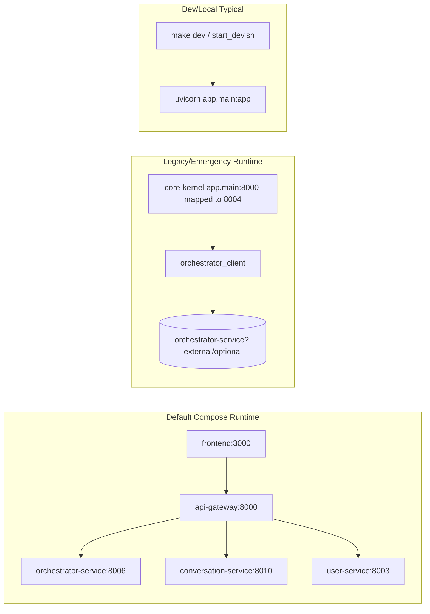

# 1. Executive Summary

The repository is currently operating as a **split-brain hybrid**: a powerful monolith (`app.main` / Reality Kernel) is still the practical control-plane for major chat behavior, while a microservices mesh (gateway + orchestrator + conversation + agents) exists in parallel with partially compatible contracts.

The three user journeys diverge because they do **not share one authoritative runtime path**:

- **Admin normal chat works** in monolith runtime because it is handled end-to-end inside monolith chat boundaries (`AdminChatStreamer` -> monolith `ChatOrchestrator` -> `DefaultChatHandler`) and does not require live orchestrator-service reachability for basic chat.
- **Customer normal chat fails** in monolith runtime because customer WebSocket explicitly delegates to `orchestrator_client.chat_with_agent(...)`; if orchestrator-service is absent/unreachable, customer chat collapses.
- **Super Agent / المهمة الخارقة fails for both roles** because mission dispatch in monolith strategy handler is a strict bridge call (`start_mission` -> `orchestrator_client.create_mission`) and on exception emits the user-facing error: **"Dispatch Failed"**.

This is not one bug; it is an architectural catastrophe caused by: 
1) mixed control planes, 
2) runtime-mode divergence (monolith-only scripts vs microservices compose), 
3) contract drift between frontend WS event expectations and backend WS payloads, and 
4) active copy-coupling between `app/services/overmind` and `microservices/orchestrator_service/src/services/overmind`.

---

# 2. Runtime Truth Map

## 2.1 Default runtime (compose modern)

**Source:** `docker-compose.yml`

- Runs `frontend`, `api-gateway`, `orchestrator-service`, `conversation-service`, and domain agents/services.
- `api-gateway` is public ingress at `:8000`.
- Chat WS routes (`/api/chat/ws`, `/admin/api/chat/ws`) are gateway-proxied to orchestrator (default rollout=0) or conversation-service (if rollout increased).
- Monolith (`app.main`) is **not** part of default compose runtime.

## 2.2 Legacy/emergency runtime

**Source:** `docker-compose.legacy.yml`

- Activates only with `profiles: ["legacy", "emergency"]`.
- Starts `core-kernel` (monolith) and `postgres-core`.
- Explicit break-glass variables required (`LEGACY_APPROVAL_TICKET`, `LEGACY_EXPIRES_AT`).
- No api-gateway, no frontend container, no conversation-service in this file.

## 2.3 Dev/local runtime

**Sources:** `Makefile`, `scripts/start-backend.sh`, `scripts/start_dev.sh`, `.devcontainer/docker-compose.host.yml`

- Primary developer commands still run `uvicorn app.main:app` directly (monolith).
- `.devcontainer/docker-compose.host.yml` runs only `web` service mounting repo and uses startup supervisor scripts; no microservices stack in that file.
- This means many developers can be on monolith runtime while believing they are validating microservices behavior.

## 2.4 Mermaid runtime map

## 2.5 Component table (runtime authority)

| Component | Default compose | Legacy/emergency | Dev/local typical | Authority today |
|---|---|---|---|---|
| `app.main` monolith | Not started | Started (`core-kernel`) | Started directly | Real authority in local/dev + break-glass |
| `api-gateway` | Started | Not started | Usually not started | Authority only in modern compose |
| `orchestrator-service` | Started | Not in legacy compose | Usually absent | Required by customer/super-agent bridges |
| `conversation-service` | Started | Not present | Usually absent | Minimal parity service, not full mission owner |
| `frontend` (Next.js) | Started | Not present | Often absent (monolith static UI used) | Mixed |

---

# 3. Full System Inventory

## 3.1 Core platform services

| Name | Status | Responsibility | Ingress/API | WebSocket ownership | Dependencies | Data ownership | Architectural assessment |
|---|---|---|---|---|---|---|---|
| `api-gateway` | Active | HTTP/WS proxy and route shaping | `:8000` | Proxies `/api/chat/ws` + `/admin/api/chat/ws` | all services | none | Partial API-first edge, but routes target services with incompatible contracts |
| `orchestrator-service` | Active | Missions, event stream, LangGraph execution endpoints | `/missions`, `/api/chat/ws`, `/admin/api/chat/ws`, `/agent/chat` | Native WS endpoints | Postgres + Redis + agents | Orchestrator DB | Strong candidate as control-plane, but not sole authority in repo |
| `conversation-service` | Active but minimal | Placeholder parity for chat HTTP/WS | `/api/chat/*`, WS same paths | Native WS simple loop | none | none | Incomplete/placeholder; no mission ownership |
| `user-service` | Active | auth/ums/admin user management | `/api/v1/auth`, `/api/v1/*` | none | user DB | user DB | Clean domain microservice for user mgmt; not chat owner |
| `planning-agent` | Active | planning domain | `/api/v1/planning/*` via gateway | none | postgres-planning | planning DB | appears serviceized |
| `memory-agent` | Active | memory domain | `/api/v1/memory/*` | none | postgres-memory | memory DB | appears serviceized |
| `research-agent` | Active | research/content | `/api/v1/research/*` | none | postgres-research | research DB | serviceized |
| `reasoning-agent` | Active | reasoning | `/api/v1/reasoning/*` | none | postgres-reasoning | reasoning DB | serviceized |
| `observability-service` | Active | observability APIs | `/api/v1/observability/*` | none | postgres-observability | observability DB | serviceized |

## 3.2 Monolith/control-plane components

| Name | Status | Responsibility | Ingress/API | WebSocket ownership | Dependencies | Data ownership | Assessment |
|---|---|---|---|---|---|---|---|
| `RealityKernel` (`app/kernel.py`) | Active | App composition + routers + lifecycle | all monolith routes | through routers | DB, redis bridge | core DB | Still a full app platform, not retired |
| `admin router` | Active | admin chat WS + convo APIs | `/admin/api/chat/ws` etc | yes | monolith chat services | `admin_conversations/messages` | Works standalone in monolith mode |
| `customer_chat router` | Active | customer chat WS + convo APIs | `/api/chat/ws` etc | yes | **hard dependency orchestrator_client for chat stream** | `customer_conversations/messages` | Hybrid bridge route; fragile |
| `app/services/chat/*` | Active | intent + handlers + streaming | internal | n/a | AI client + orchestrator_client for some intents | mixed | second "brain" still active |
| `app/services/overmind/*` | Active + duplicated | legacy/bridge overmind logic | internal | mission/event helpers | orchestrator_client + DB models | monolith models | phantom-limb duplicate of microservice overmind |

## 3.3 Agent inventory (explicit)

- In orchestrator-service Overmind: strategist, architect, operator, auditor, admin, analytics, memory, curriculum, etc. (active code paths exist).
- In monolith chat/overmind: parallel agent/orchestrator logic also exists.
- `scripts/fitness/check_overmind_copy_coupling.py` confirms **active overlap metric = 108 files** between monolith and microservice overmind trees (strict-decrease policy only, not elimination).

---

# 4. Agent Architecture Diagnosis

## 4.1 Where orchestration authority actually lives

- **Intended authority (microservice view):** orchestrator-service (`/missions`, LangGraph service factory, mission state manager, Redis event bus).
- **Actual authority (runtime reality):** depends on runtime profile:
  - dev/local and legacy: monolith chat entrypoints remain first-class and execute significant orchestration logic.
  - default compose: gateway forwards to orchestrator/conversation, but frontend/backend event contracts are inconsistent.

## 4.2 Where chat authority actually lives

- **Admin normal chat (monolith runtime):** monolith admin boundary + monolith chat orchestrator + default handler.
- **Customer normal chat (monolith runtime):** customer WS route delegates directly to orchestrator-service via `orchestrator_client.chat_with_agent`.
- This is already a hard split within monolith itself (admin local path vs customer remote path).

## 4.3 Boundary health

Boundaries are **broken** by design:
- Role boundary includes backend divergence in control-plane.
- Mission logic duplicated across monolith and microservice trees.
- Frontend expects event envelopes (`delta`, `assistant_delta`, etc.) while some backend routes return plain `{"status":"ok","response":...}` JSON.

---

# 5. Monolith Residue Diagnosis

## 5.1 Runtime/control-plane residues

**Evidence**
- Dev commands run `uvicorn app.main:app` directly.
- Legacy compose still boots `core-kernel`.

**Severity:** Critical

**Why it matters**
- Production behavior cannot be reasoned from one runtime truth.

**Direction**
- Force single default runtime for all environments with explicit break-glass isolation.

## 5.2 Import contamination residues

Direct microservice import contamination from `app.*` is low in `microservices/` (search mostly clean).

**Severity:** Moderate

**Why it matters**
- Good sign, but runtime coupling still exists without imports.

**Direction**
- Keep import purity gate + enforce contract-only integration tests.

## 5.3 Phantom-limb copy-coupling residues

**Evidence**
- Fitness script reports overlap metric 108 between `app/services/overmind` and `microservices/orchestrator_service/src/services/overmind`.

**Severity:** Critical

**Why it matters**
- Duplicate brains produce split fixes and divergence drift.

**Direction**
- Hard retirement plan for one tree (prefer orchestrator-service ownership).

## 5.4 State ownership residues

**Evidence**
- ARCHITECTURE.md claims monolith DB is source of truth and microservice orchestrator is deprecated worker.
- Current microservice code creates/owns mission state in orchestrator DB + Redis events.

**Severity:** Critical

**Why it matters**
- Competing truth definitions create operational incoherence.

**Direction**
- Single authoritative mission state owner contract (orchestrator-service) and remove contradictory docs/code paths.

## 5.5 Documentation/runtime split-brain residues

**Evidence**
- Constitution mandates true microservices/API-first; ARCHITECTURE.md states monolith overmind control-plane.
- Compose modern excludes monolith, but dev scripts default to monolith.

**Severity:** Critical

**Why it matters**
- Teams build against different realities.

**Direction**
- Publish one canonical runtime matrix and fail CI if startup scripts violate it.

---

# 6. Admin Chat vs Customer Chat vs Super Agent Forensic Comparison

## 6.1 Deep comparison table

| Journey | Frontend entry | WS route | Runtime owner | Core handler | State owner | Dependencies | Works/Fails | Why |
|---|---|---|---|---|---|---|---|---|
| Admin normal chat | `endpoint = '/admin/api/chat/ws'` | monolith `/admin/api/chat/ws` OR gateway equivalent | In monolith mode: admin router + AdminChatStreamer | `ChatOrchestrator.process` -> often `DefaultChatHandler` | monolith admin conversation tables | AI provider mainly | **Works (observed)** | Local monolith path does not require orchestrator-service for default chat |
| Customer normal chat | `endpoint = '/api/chat/ws'` | monolith `/api/chat/ws` OR gateway equivalent | In monolith mode: customer router | `orchestrator_client.chat_with_agent(...)` | mixed (customer convo local, generation remote) | **orchestrator-service reachability** | **Fails (observed)** | hard remote dependency; if orchestration backend unavailable, no usable answer path |
| Super Agent mission_complex | Chat UI mission selector sends `mission_type` | same WS route as above | Monolith mission handler when using monolith path | `MissionComplexHandler.execute` -> `start_mission` -> `orchestrator_client.create_mission` | orchestrator mission state expected remote | orchestrator-service `/missions` + downstream mission stack | **Fails for both** | Dispatch bridge exception branch emits "Dispatch Failed" |

## 6.2 Narrative

- Admin and customer are not symmetric. Admin has a local fallback brain (monolith default chat); customer is effectively a remote-dependent client path.
- Super Agent is an even stronger remote dependency for both roles because mission creation is always delegated.
- Therefore failures naturally cluster as: admin chat survives, customer chat fails, super-agent fails universally when orchestrator path is unhealthy/unreachable.

---

# 7. Dispatch Failure Root Cause Analysis

## 7.1 Ranked hypotheses

1. **Highest confidence (0.88): orchestrator-service unreachable/unhealthy from active runtime path.**
   - `MissionComplexHandler` catches any exception from `start_mission` and emits fixed error text containing `(Dispatch Failed)`.
   - `start_mission` strictly delegates to `orchestrator_client.create_mission`.
   - `orchestrator_client` defaults to `http://orchestrator-service:8006` when setting missing; this hostname fails outside Docker network.

2. **Medium confidence (0.62): runtime mismatch where monolith runs alone while orchestrator isn’t started.**
   - Dev scripts and Makefile launch monolith only.
   - Customer and mission paths still require orchestrator-service.

3. **Lower confidence (0.41): gateway/websocket contract mismatch causing perceived dispatch/chat failure in modern compose.**
   - Frontend mission selector sends top-level `mission_type`; orchestrator WS expects `metadata.mission_type` for mission_complex routing.
   - Orchestrator normal WS reply format differs from frontend event reducer expectations.

## 7.2 Highest-confidence root cause

**Root cause:** mission dispatch bridge in monolith is tightly coupled to orchestrator-service network availability, while common runtimes start monolith without ensuring orchestrator-service path validity.

## 7.3 Exact control path

UI mission selection -> WS message -> monolith `MissionComplexHandler.execute` -> `start_mission(...)` -> `orchestrator_client.create_mission(...)` -> exception -> handler emits:

`"❌ ... لم نتمكن من بدء المهمة (Dispatch Failed)."`

That exact user-facing string is defined in `app/services/chat/handlers/strategy_handlers.py` exception branch.

---

# 8. StateGraph Diagnosis

## 8.1 Current model

There are **multiple graph/state models** active:

- Orchestrator microservice LangGraph path (`create_langgraph_service` + `LangGraphAgentService.run`) used by orchestrator chat endpoints.
- Monolith chat path that can bypass mission graph entirely (default chat handler, local stream).
- Monolith proxy LangGraph service (`app/services/overmind/langgraph/service.py`) that maps run requests to mission creation and returns mostly empty plan/design/execution/audit fields.

## 8.2 Is live system actually graph-first?

No. Graph usage is partial and route-dependent.

- Normal admin chat in monolith can bypass graph.
- Mission path depends on bridge to orchestrator mission engine.
- Customer path in monolith depends on remote agent chat stream, not explicit graph-state ownership in monolith.

## 8.3 State ownership problems

- Conversation state: split across admin/customer monolith tables.
- Mission state: expected in orchestrator DB/event bus.
- Frontend session state: reducer expects event contracts not consistently emitted by all backends.

## 8.4 Why graph is isolated/broken

- No single control plane contract forces all chat/super flows through one graph gateway.
- WS payload schema mismatch (`mission_type` vs `metadata.mission_type`) disconnects UI super-agent intent from graph mission branch in orchestrator WS.

---

# 9. Target StateGraph Architecture for 100% API-First Microservices

## 9.1 Correct ownership

- **Orchestrator-service owns all mission + graph execution state.**
- **Conversation-service owns conversation/session projection only** (or merge into orchestrator BFF if simpler).
- Monolith should own zero runtime mission/chat orchestration logic on default path.

## 9.2 Correct flow

1. Frontend sends chat/super intents to gateway.
2. Gateway forwards to one authoritative conversational orchestration API (HTTP + WS contract aligned).
3. That service routes:
   - simple chat -> lightweight graph profile
   - mission_complex -> full mission graph
4. Progress and phase events stream from orchestrator event bus through a stable WS/SSE contract.
5. Conversation projections persisted separately as read models.

## 9.3 Correct WS/event contract

Single schema across routes:
- `conversation_init`
- `assistant_delta`
- `assistant_final`
- `RUN_STARTED`, `PHASE_STARTED`, `PHASE_COMPLETED`
- `assistant_error`
- `complete`

No route-specific ad hoc payload shapes.

## 9.4 Correct boundaries

- Gateway owns ingress only.
- Orchestrator owns intent-to-graph execution and mission lifecycle.
- User-service owns identity/roles.
- No monolith overmind/chat handler on live path.

---

# 10. Definition of “100% Microservices” for THIS repository

PASS/FAIL gates:

1. **No monolith on default path**
   - PASS when `app.main` is absent from default startup scripts/compose.
2. **No admin/customer split-brain**
   - PASS when both roles hit same orchestration API with policy-only divergence.
3. **No super-agent dispatch via legacy bridge**
   - PASS when `MissionComplexHandler` bridge path removed from live flow.
4. **No app contamination in microservices runtime behavior**
   - PASS when microservices don’t rely on monolith runtime components.
5. **No active duplicate brain**
   - PASS when overmind copy-coupling overlap metric reaches 0.
6. **Route ownership clarity**
   - PASS when route catalog maps each path to exactly one owning service.
7. **Stategraph live-path correctness**
   - PASS when all chat/super traffic emits graph-consistent events.
8. **Service completeness**
   - PASS when conversation/orchestrator contracts satisfy frontend reducers without compatibility shims.

---

# 11. Deep Modernization Blueprint

## Phase 0: containment & truth
- **Goals:** freeze architecture drift; establish single runtime truth matrix.
- **Deliverables:** canonical runtime document + CI checks ensuring startup scripts and compose parity.
- **Exit criteria:** no undocumented runtime mode.
- **Rollback philosophy:** retain break-glass legacy profile only, time-boxed.
- **Major risks:** hidden operational dependencies on monolith-only endpoints.

## Phase 1: single chat/control plane
- **Goals:** unify admin/customer chat to same backend contract.
- **Deliverables:** one chat WS/API contract; role authorization at policy layer only.
- **Exit criteria:** admin and customer chat use identical event schema and backend owner.
- **Rollback:** route-level canary via gateway with measured error budget.
- **Risks:** contract migration impacts existing UI clients.

## Phase 2: dispatch/stategraph normalization
- **Goals:** all mission_complex and advanced flows on orchestrator graph.
- **Deliverables:** mission intent schema fix (`metadata` normalization), end-to-end graph telemetry.
- **Exit criteria:** zero "Dispatch Failed" from bridge path; mission events deterministic.
- **Rollback:** canary by mission type.
- **Risks:** latent edge cases in event bus and retries.

## Phase 3: phantom-limb elimination
- **Goals:** remove duplicate overmind/chat execution trees from monolith runtime path.
- **Deliverables:** copy-coupling overlap down to zero; archived compatibility adapters only.
- **Exit criteria:** no duplicated execution logic in `app/services/overmind` and orchestrator-service.
- **Rollback:** feature flags at gateway only (not code duplication rollback).
- **Risks:** regression in legacy scripts/tests.

## Phase 4: hard-zero monolith retirement
- **Goals:** monolith no longer handles live chat/mission control plane.
- **Deliverables:** monolith endpoints disabled or removed from default.
- **Exit criteria:** production traffic fully microservice-owned.
- **Rollback:** emergency profile with strict expiry + approval ticket.
- **Risks:** operational readiness gaps during final cutover.

---

# 12. Top 30 Structural Problems

1. Critical — Split control-plane between monolith and orchestrator.  
2. Critical — Admin and customer normal chat take different backend authorities.  
3. Critical — Super-agent dispatch coupled to fragile bridge call.  
4. Critical — `Dispatch Failed` masks underlying failure class (network/auth/timeout).  
5. High — Dev runtime defaults to monolith, not modern compose.  
6. High — Legacy profile still operational and broad.  
7. High — ARCHITECTURE.md contradicts microservices constitution.  
8. High — overmind copy-coupling overlap still 108 files.  
9. High — duplicated state models across app and microservice trees.  
10. High — customer router hard-depends on orchestrator client for ordinary chat.  
11. High — monolith AppSettings lacks explicit ORCHESTRATOR_SERVICE_URL field.  
12. High — orchestrator client falls back to Docker hostname in non-docker runtimes.  
13. High — frontend super-agent payload shape mismatch (`mission_type` vs `metadata`).  
14. High — WS event contract mismatch across services.  
15. Medium — conversation-service is placeholder but in live routing decisions.  
16. Medium — gateway canary routing without strict contract parity tests.  
17. Medium — user-service targeted for admin proxy paths unrelated to chat ownership.  
18. Medium — route ownership spread across monolith + gateway + services.  
19. Medium — no single source for live route catalog enforcement.  
20. Medium — stategraph usage is route-dependent, not universal.  
21. Medium — frontend has dual app stacks (legacy static + Next.js) increasing drift.  
22. Medium — insufficient runtime probes distinguishing path-level health.  
23. Medium — mission and chat lifecycle events not normalized end-to-end.  
24. Medium — implicit assumptions in websocket proxy header forwarding.  
25. Medium — missing explicit failure taxonomy for mission dispatch.  
26. Medium — conversation persistence split by role without unified abstraction contract at API layer.  
27. Medium — CI gates track strict decrease, not elimination, for copy-coupling.  
28. Medium — docs contain stale diagnostics that can conflict with current code reality.  
29. Medium — emergency break-glass governance present but normal path still ambiguous.  
30. Medium — architecture governance fragmented across multiple docs with conflicting authority.

---

# 13. Top 30 Architecture Backlog Items

1. Define single authoritative chat/missions owning service (DoD: approved ADR + route map).  
2. Enforce one default runtime path in scripts and docs (DoD: CI fails on monolith default startup).  
3. Add explicit `ORCHESTRATOR_SERVICE_URL` to monolith settings schema (DoD: typed config + startup validation).  
4. Remove Docker-hostname fallback in non-docker runtimes (DoD: fail-fast with actionable error).  
5. Normalize WS payload schema for mission mode (`metadata.mission_type`) (DoD: contract tests).  
6. Normalize WS response event schema across orchestrator/conversation (DoD: consumer contract pass).  
7. Unify admin/customer chat ingress to same backend path (DoD: same handler stack, role policy only).  
8. Eliminate monolith `MissionComplexHandler` live-path dispatch (DoD: no Dispatch Failed string reachable).  
9. Add structured dispatch error taxonomy (DoD: code+metrics for timeout/auth/dns/service-unhealthy).  
10. Introduce route ownership registry with CI enforcement (DoD: generated map with uniqueness checks).  
11. Implement end-to-end mission synthetic test (DoD: create mission + stream events + terminal status).  
12. Implement end-to-end customer chat synthetic test (DoD: WS connect/send/receive expected event types).  
13. Implement end-to-end admin chat synthetic test (DoD: same as customer with role guard assertions).  
14. Promote orchestrator graph as mandatory path for all super-agent intents (DoD: forced path assertions).  
15. Sunset conversation-service placeholder or complete it (DoD: supports mission contract or removed from routing).  
16. Remove duplicated overmind modules in monolith tree (DoD: overlap metric to 0).  
17. Decommission legacy static app or align it to same contracts (DoD: one supported UI runtime).  
18. Harden gateway health to include contract-level readiness, not only `/health` ping (DoD: chat+mission probe).  
19. Add correlation ID propagation through WS and mission events (DoD: visible in logs/traces).  
20. Add architecture drift dashboard (DoD: runtime/profile/route ownership mismatches surfaced).  
21. Consolidate architecture docs to one source of truth (DoD: conflicting docs retired).  
22. Add service completeness checklist for every routed capability (DoD: checklist in CI gate).  
23. Introduce canary rollback automation for chat/super-agent routes (DoD: one-command rollback).  
24. Add explicit websocket auth compatibility test through gateway proxy (DoD: subprotocol and token pass verified).  
25. Move customer conversation generation ownership away from monolith bridge (DoD: no orchestrator_client in customer router).  
26. Remove admin chat local fallback execution from monolith default path (DoD: admin uses same microservice API).  
27. Build state ownership matrix artifact in repo (DoD: mission/chat/session owners explicit).  
28. Add failure budget SLO for dispatch and WS flows (DoD: tracked metrics with alerting).  
29. Gate releases on zero critical split-brain findings (DoD: architecture fitness suite).  
30. Hard-disable monolith runtime in production profile (DoD: startup guard + break-glass only).

---

# 14. Appendix: Evidence Index

## 14.1 Files inspected (representative)

- Runtime/composition: `docker-compose.yml`, `docker-compose.legacy.yml`, `.devcontainer/docker-compose.host.yml`, `Makefile`, `scripts/start-backend.sh`, `scripts/start_dev.sh`, `scripts/launch_stack.sh`, `scripts/start-docker.sh`.
- Gateway: `microservices/api_gateway/main.py`, `microservices/api_gateway/config.py`, `microservices/api_gateway/websockets.py`.
- Monolith chat: `app/api/routers/admin.py`, `app/api/routers/customer_chat.py`, `app/services/admin/chat_streamer.py`, `app/services/customer/chat_streamer.py`, `app/services/chat/orchestrator.py`, `app/services/chat/handlers/strategy_handlers.py`.
- Mission bridge: `app/services/overmind/entrypoint.py`, `app/infrastructure/clients/orchestrator_client.py`.
- Orchestrator microservice: `microservices/orchestrator_service/src/api/routes.py`, `.../services/overmind/entrypoint.py`, `.../utils/mission_complex.py`, `.../factory.py`, `.../langgraph/service.py`.
- Frontend: `frontend/app/components/CogniForgeApp.jsx`, `frontend/app/hooks/useAgentSocket.js`, `frontend/app/hooks/useRealtimeConnection.js`, `frontend/next.config.js`, `app/static/js/legacy-app.jsx`.
- Governance/docs: `ARCHITECTURE.md`, `docs/architecture/MICROSERVICES_CONSTITUTION.md`, `config/overmind_copy_coupling_baseline.json`, `scripts/fitness/check_overmind_copy_coupling.py`.

## 14.2 Search patterns executed

1. `rg -n "Dispatch Failed|dispatch failed|MissionComplexHandler|DefaultChatHandler|create_mission|orchestrator_client|chat|websocket|ws|conversation|super agent|mission" .`
2. `rg -n "from app|import app|app\.core|app\.services" microservices/`
3. `rg -n "overmind|LangGraph|state|graph|workflow|mission|contextualizer|strategist|architect|operator|auditor" .`
4. `rg -n "CORE_KERNEL_URL|core-kernel|legacy|emergency|fallback|proxy|conversation-service|orchestrator-service" docker-compose* .devcontainer scripts docs microservices/`
5. Route and websocket inspection in gateway/service/frontend files listed above.

## 14.3 Key findings by directory

- `app/`: monolith remains functional runtime with active chat/mission logic and bridge dependency to orchestrator-service.
- `microservices/`: contains modern services, but contract and ownership alignment incomplete for chat/super-agent E2E.
- `frontend/`: modern app sends role-specific WS endpoints and mission mode selector, but event/mission payload contracts can diverge from backend expectations.
- `docs/`: contains conflicting architecture authority statements (microservices constitution vs monolith-centric ARCHITECTURE.md).
- `scripts/` + compose: startup and runtime surfaces differ materially, sustaining split-brain operation.
