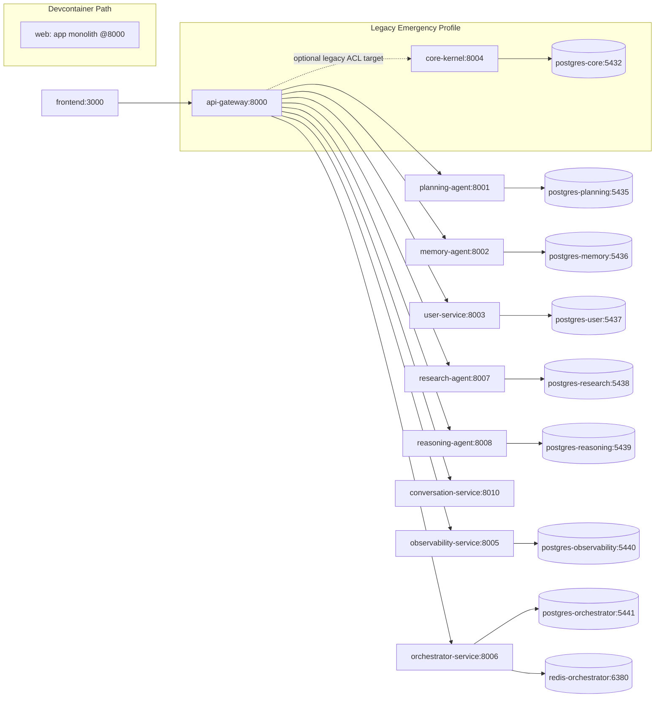

# 1) Executive Summary (max 20 lines)
- This repository has materially advanced Strangler-Fig migration, but **is not yet 100% microservices** because the control-plane is still operationally dual: default runtime is microservices, while emergency runtime still exposes `core-kernel` and `postgres-core` via `docker-compose.legacy.yml` profiles (`legacy`, `emergency`).
- The single most dangerous residue is **policy/runtime/documentation split-brain around orchestration authority**, where architecture docs and runbooks disagree on who owns mission/chat flows (`app/services/overmind` vs `microservices/orchestrator_service`).
- Direct phantom-limb imports (`from app...`) inside `microservices/` are currently near-zero by static scan, but **phantom-limb copy-coupling is severe**: large overmind trees appear duplicated between `app/services/overmind` and `microservices/orchestrator_service/src/services/overmind`.
- Gateway cutover controls exist (canary rollout percentages, consumer contracts, fitness scripts), but enforcement is incomplete (e.g., legacy-route baseline script still allows non-zero legacy surfaces; emergency path exists without strict automated expiry enforcement in runtime).
- Service topology drift exists: `microservices/auditor_service` has `src/main.py` but no Dockerfile and no compose registration, indicating incomplete service lifecycle ownership.
- “100% microservices” should be treated as a **measurable state**, not a slogan: zero core-kernel runtime dependency, zero legacy route traffic over a defined window, zero `app` contamination by import/copy coupling, and contract-verified ownership for all externally reachable routes.
- Recommended path: 4-phase strangler with hard gates, rollback by route family, and CI fitness functions that escalate from monotonic legacy reduction to hard-zero constraints.

# 2) System Reality Map (Runtime Truth)

## Runtime derivation evidence
- Default runtime (`docker-compose.yml`) runs gateway + microservices + per-service databases; includes `conversation-service` and `orchestrator-service`.
- Emergency legacy runtime (`docker-compose.legacy.yml`) still defines `core-kernel` + `postgres-core` with profiles `legacy`/`emergency` and approval metadata env vars.
- Devcontainer runtime (`.devcontainer/docker-compose.host.yml`) still runs monolith backend container `web` from repo root Dockerfile and maps `8000:8000`.
- Startup helpers and quick-start scripts include legacy startup paths that launch `app.main` directly (`scripts/misc/quick_start_api_gateway.sh`).

## Mermaid runtime map

## Component table
| Component | Current runtime status | Evidence | Risk note |
|---|---|---|---|
| `api-gateway` | Active default ingress | `docker-compose.yml`, `microservices/api_gateway/main.py` | Central point for both modern + compatibility route families |
| `orchestrator-service` | Active in default runtime | `docker-compose.yml`, `microservices/orchestrator_service/main.py` | Conflicts with ADR claiming orchestrator microservice removed |
| `conversation-service` | Active WS/HTTP candidate | `docker-compose.yml`, `microservices/conversation_service/main.py` | Parity service still canary-routed |
| `core-kernel` | Active only via legacy/emergency profile | `docker-compose.legacy.yml` | Residual monolith dependency persists operationally |
| Devcontainer `web` | Active monolith image for local/dev | `.devcontainer/docker-compose.host.yml` | Reintroduces monolith runtime path |
| `auditor_service` | Code exists, not runtime-registered | `microservices/auditor_service/src/main.py` + missing Dockerfile/compose entry | Ownership/deployment drift |

# 3) Definition of “100% Microservices” (Measurable Gates)

## PASS/FAIL gates
| Gate | PASS condition | FAIL condition | Measurement command(s) |
|---|---|---|---|
| G1 Control plane singularity | No production/default route depends on `core-kernel`; legacy compose disabled by policy except time-boxed drill | Any active non-drill dependency on `core-kernel` | `rg -n "core-kernel|CORE_KERNEL_URL" docker-compose*.yml microservices/api_gateway` |
| G2 Legacy route retirement | Legacy compatibility routes count = 0 in gateway (or isolated behind disabled feature flags with hard expiry) | Any deprecated compatibility route still reachable | `rg -n "deprecated=True|/admin/|/system/|/v1/content|/api/chat" microservices/api_gateway/main.py` |
| G3 Legacy traffic hard-zero | 30-day window: `legacy_request_total_30d==0`, `legacy_ws_sessions_total_30d==0` | Non-zero in window | `python scripts/fitness/check_legacy_traffic_zero_window.py` |
| G4 Phantom import isolation | Zero `from app` / `import app` in `microservices/` | Any import edge to `app` namespace | `rg -n "from app|import app|app\.core|app\.services" microservices/` |
| G5 Phantom copy-coupling ceiling | No duplicated domain modules across `app/services/*` and `microservices/*` for active bounded contexts | Same module families maintained in both places | `comm -12 <(find app/services/overmind -type f|sed 's#app/services/overmind/##'|sort) <(find microservices/orchestrator_service/src/services/overmind -type f|sed 's#microservices/orchestrator_service/src/services/overmind/##'|sort)` |
| G6 Runtime-doc parity | ADRs/runbooks match actual compose/runtime | Contradictory architecture truth | `rg -n "deprecated and removed|orchestrator_service|core-kernel" docs/architecture/*.md docker-compose*.yml` |
| G7 Service registry completeness | Every `microservices/*` service has Dockerfile + compose registration + owner | Missing Dockerfile or no runtime wiring | `for d in microservices/*; do ...; done` (see appendix query) |
| G8 Contract verified ingress | Every gateway route has contract + provider verification pass | Undeclared gateway route or contract mismatch | `python scripts/fitness/check_gateway_provider_contracts.py` |

## Stop-ship criteria
- Any new gateway compatibility route added without corresponding deprecation window + owner + sunset.
- Any merge introducing `CORE_KERNEL_URL` usage outside legacy ACL path.
- Any detected new copy-coupled module family between `app/` and active microservice domains.
- Any route ownership mismatch between gateway runtime and route registry/contract files.

# 4) Root Cause #1 (Single Most Dangerous Residue)

## **Control-plane authority split-brain across runtime, docs, and fallback orchestration paths**

### Evidence pack
1. `docker-compose.yml` actively runs `orchestrator-service` and `conversation-service` in default runtime.
2. `docker-compose.legacy.yml` keeps `core-kernel` + `postgres-core` callable under `legacy`/`emergency` profiles.
3. `.devcontainer/docker-compose.host.yml` defines `web` monolith service from repo root Dockerfile.
4. `microservices/api_gateway/config.py` still carries `CORE_KERNEL_URL` setting (nullable but present).
5. `microservices/api_gateway/legacy_acl/adapter.py` implements explicit HTTP/WS forwarding to `CORE_KERNEL_URL`.
6. `scripts/fitness/check_core_kernel_acl.py` exists because `CORE_KERNEL_URL` leakage is recognized as a known risk.
7. `scripts/fitness/check_core_kernel_env_profile.py` enforces core-kernel only in legacy compose, proving fallback is still part of architecture.
8. `microservices/api_gateway/main.py` has compatibility/deprecated route families (`/api/chat/*`, `/v1/content/*`, `/api/v1/data-mesh/*`, `/system/*`, `/admin/*`).
9. `scripts/check_legacy_routes.sh` baseline allows non-zero legacy routes (`BASELINE=5`) rather than enforcing zero.
10. `docs/architecture/04_adr_002_unified_orchestration.md` declares `microservices/orchestrator_service` “deprecated and removed”.
11. Runtime contradicts ADR #10 because `microservices/orchestrator_service/main.py` is active and compose-wired.
12. `docs/architecture/ROUTE_OWNERSHIP_REGISTRY.md` route ownership targets `orchestrator-service` and `conversation-service` (modern truth).
13. `scripts/misc/quick_start_api_gateway.sh` still starts `uvicorn app.main:app` and uses `app.cli` migration path.
14. `docs/contracts/consumer/gateway_chat_content_contracts.json` states gateway providers are microservices (`orchestrator-service`, `research-agent`, `conversation-service`), diverging from older ADR worldview.
15. `docs/architecture/CONTROL_PLANE_CUTOVER_PLAN.md` frames staged isolation of core-kernel, confirming unresolved transition.
16. `docs/architecture/LEGACY_EMERGENCY_RUNBOOK.md` includes emergency enable path exporting `CORE_KERNEL_URL`.

### Risk scoring
- **Impact: 5/5** — Wrong control-plane authority can misroute mission/chat state, causing user-visible data inconsistency.
- **Likelihood: 4/5** — Contradictory docs/scripts make accidental reactivation or wrong deployment profile plausible.
- **Blast Radius: 5/5** — Gateway is single ingress; routing mistakes affect all tenants and critical mission flows.

### Failure story (a): outage
A release engineer follows stale ADR/quick-start guidance and deploys a monolith-centric path while default compose expects orchestrator microservice ownership. Gateway compatibility routes partially resolve to different backends; mission websocket clients oscillate between providers with incompatible state history, producing widespread 5xx/timeout spikes.

### Failure story (b): security/operability pivot
An emergency toggle re-enables legacy core-kernel route quickly, but expiry governance is manual. The fallback remains active past incident window; new traffic quietly bypasses intended microservice auth/telemetry contract boundaries, degrading traceability and increasing lateral movement surface.

### Why solving Root Cause #1 unlocks the rest
Once authority is singular and codified (runtime + docs + CI policy aligned), both residue classes collapse faster:
- Legacy route families can be drained deterministically.
- Phantom-limb duplication pressure decreases because only one domain owner remains per capability.

# 5) Monolith Residue Inventory (Ranked)

## A) Control-plane duality residues
| Rank | Residue | Evidence | Risk | Mitigation direction |
|---|---|---|---|---|
| 1 | Emergency core-kernel path still first-class artifact | `docker-compose.legacy.yml`, `legacy_acl/adapter.py`, `LEGACY_EMERGENCY_RUNBOOK.md` | High | Restrict to signed break-glass flow + auto-expiry gate + routing deny by default |
| 2 | Gateway compatibility routes still present | `microservices/api_gateway/main.py` deprecated routes | High | Route-family retirement plan with traffic SLO + hard remove dates |
| 3 | WS split targeting orchestrator/conversation via rollout | `_resolve_chat_ws_target`, rollout envs in `config.py` | High | Contract-lock WS envelope + converge owner to conversation-service |
| 4 | Baseline-based governance allows residual legacy | `scripts/check_legacy_routes.sh` `BASELINE=5` | Medium/High | Replace with monotonic-to-zero then hard-zero CI gate |
| 5 | Devcontainer monolith runtime path | `.devcontainer/docker-compose.host.yml` `web` service | Medium | Provide dedicated microservices dev profile; mark monolith profile explicit legacy-only |
| 6 | Documentation contradictions on orchestrator authority | ADR-002 vs compose/runtime vs route registry | High | ADR supersession + architecture truth source automation |

## B) Phantom-limb residues
| Rank | Residue | Evidence | Risk | Mitigation direction |
|---|---|---|---|---|
| 1 | Overmind subtree copy-coupled between monolith and orchestrator microservice | large filename overlap via `comm` between `app/services/overmind` and `microservices/orchestrator_service/src/services/overmind` | High | Declare microservice as sole owner, freeze monolith copy, retire duplicated modules by domain slices |
| 2 | Legacy startup script still binds gateway quickstart to monolith app entry | `scripts/misc/quick_start_api_gateway.sh` uses `app.main` and `app.cli` | Medium/High | Split script into `quick_start_legacy.sh` vs `quick_start_microservices.sh` with explicit policy tags |
| 3 | `microservices/api_gateway/app/*` shadow namespace creates ambiguity with root `app/` | `microservices/api_gateway/app/` package exists alongside root `app/` | Medium | Rename internal gateway package namespace to avoid semantic collision |
| 4 | Service lifecycle incompleteness causing fallback temptation | `auditor_service` missing Dockerfile/compose | Medium | Either fully onboard service (build+deploy+owner) or archive code until needed |
| 5 | Direct `from app` imports currently low but policy not fully enforced for copy-coupling | required scan shows near-zero import edges | Medium | Add duplication heuristics + ownership lints, not only import lints |

# 6) Boundary & Ownership Blueprint (Target Microservices Architecture v1)

## Bounded contexts and service catalog
| Context | Target service owner | API surface | Data ownership | Target SLO |
|---|---|---|---|---|
| Identity & Access | `user-service` team | `/api/v1/users/*`, `/api/v1/auth/*`, `/admin/*` (transitional) | `postgres-user` | 99.9% |
| Mission Orchestration | `orchestrator-service` team (or explicit successor if renamed) | `/api/v1/overmind/*`, `/api/v1/missions/*`, `/missions/{id}/ws` | `postgres-orchestrator` + redis stream state | 99.9% |
| Conversation | `conversation-service` team | `/api/chat/*`, `/api/chat/ws`, `/admin/api/chat/ws` | conversation DB/event log (to be provisioned) | 99.95% |
| Planning | `planning-agent` team | `/api/v1/planning/*` | `postgres-planning` | 99.9% |
| Memory | `memory-agent` team | `/api/v1/memory/*` | `postgres-memory` | 99.9% |
| Research | `research-agent` team | `/api/v1/research/*`, `/v1/content/*` (transitional) | `postgres-research` | 99.9% |
| Reasoning | `reasoning-agent` team | `/api/v1/reasoning/*` | `postgres-reasoning` | 99.9% |
| Observability | `observability-service` team | `/api/v1/observability/*`, `/api/v1/data-mesh/*` (transitional) | `postgres-observability` | 99.9% |

## Route ownership registry (migration table)
| Route family | Current owner | Target owner | Migration method |
|---|---|---|---|
| `/api/chat/*` | Gateway -> orchestrator/conversation (canary) | conversation-service | Percentage rollout + contract lock + traffic cutover |
| `/api/chat/ws`, `/admin/api/chat/ws` | Gateway WS proxy with dual target logic | conversation-service | WS contract testing + session replay + hard switch |
| `/v1/content/*` | research-agent (marked legacy route pattern) | research-agent at `/api/v1/research/*` | alias period then path deprecation |
| `/api/v1/data-mesh/*` | observability-service (legacy pattern) | observability-service canonical path | route alias retirement |
| `/system/*` | orchestrator-service compatibility path | dedicated system service or canonical orchestrator path | endpoint-by-endpoint extraction |
| `/admin/*` compatibility families | user-service | user-service canonical `/api/v1/admin/*` | consumer migration + sunset headers |

# 7) Data Ownership & Consistency Blueprint
- Current trajectory already approximates database-per-service (multiple postgres instances in default compose).
- Remaining gap is **behavior ownership consistency**, not just DB topology.

## Critical cross-service flows (design)
1. Mission creation: Gateway -> Orchestrator -> Planning/Memory/Research/Reasoning.
   - Use orchestration Saga: create mission (pending) -> invoke downstream steps -> finalize status.
   - Compensation: mark mission `partial_success` with event emission when downstream hard-fails.
2. Chat WS + mission context enrichment:
   - Conversation-service should request mission/user context via APIs, never direct DB joins.
   - Compensation: degraded response mode when upstream context unavailable.
3. Admin configuration path:
   - Route entirely to user-service bounded context; other services consume via cached config API/events.

## Idempotency + Outbox notes
- Enforce idempotency key propagation from gateway (`X-Correlation-ID` / idempotency header) into orchestration writes.
- Per service: transactional outbox table + relay process to event bus; consumers idempotent via message key dedupe.
- No cross-service direct table reads for reconciliation; use events or explicit query APIs.

# 8) Decommission Plan (4 Phases: Strangler Fig)

## Phase 0: Containment & governance
- **Goals:** freeze new residues; align truth sources.
- **Deliverables:** single architecture truth doc; CI checks for import ACL, route-count monotonicity, contract verification, compose drift.
- **Exit criteria:** 0 new legacy routes added over 2 sprints; all gateway routes listed in registry + contracts.
- **Rollback:** governance-only changes are reversible by disabling specific CI gates for max 72h with incident ticket.
- **Risks/Mitigations:** false-positive CI failures -> maintain allowlist with expiry metadata.

## Phase 1: Remove highest-risk legacy surface (WS chat) + introduce contracts
- **Goals:** end dual WS authority.
- **Deliverables:** conversation-service as sole WS provider; deterministic protocol/version contract; legacy WS toggles removed.
- **Exit criteria:** `ROUTE_CHAT_WS_CONVERSATION_ROLLOUT_PERCENT=100`; 30-day WS error budget within SLO; no WS fallback invocations.
- **Rollback:** route-level rollback to orchestrator only (not core-kernel), time-boxed 24h.
- **Risks/Mitigations:** envelope incompatibility -> CDC + replay tests before cutover.

## Phase 2: Drain remaining legacy route families + remove phantom-limb imports
- **Goals:** eliminate compatibility HTTP families and copy-coupling hotspots.
- **Deliverables:** migration playbooks per route family; `app/services/overmind` frozen/archived slices; no active duplicated module families.
- **Exit criteria:** deprecated route count in gateway = 0; `rg from app` in microservices = 0; duplicate-overlap metric reduced to agreed threshold then zero.
- **Rollback:** per-route fallback alias (microservice-to-microservice only), max 7 days, with client communication.
- **Risks/Mitigations:** consumer lag -> progressive deprecation headers + usage analytics.

## Phase 3: Remove core-kernel from default runtime and archive `app/` safely
- **Goals:** hard sever operational monolith dependency.
- **Deliverables:** no `CORE_KERNEL_URL` runtime dependency outside emergency drill harness; archived `app/` in non-runtime package; formal retirement ADR.
- **Exit criteria:** 30-day zero legacy traffic + successful disaster drill without core-kernel reactivation.
- **Rollback:** emergency legacy enable allowed only via signed ticket + enforced expiry and automated shutdown.
- **Risks/Mitigations:** unknown edge workflows -> pre-archive synthetic tests + shadow traffic analysis.

# 9) Governance: Architectural Fitness Functions (CI Gates)

## Required checks (design-level commands)
1. Forbid `from app` imports in microservices:
   - `rg -n "from app|import app|app\.core|app\.services" microservices/ && exit 1`
2. Forbid `CORE_KERNEL_URL` usage outside a single legacy ACL:
   - `python scripts/fitness/check_core_kernel_acl.py`
3. Legacy route count monotonic then hard-zero:
   - `python scripts/fitness/check_legacy_routes_monotonic.py`
   - then enforce `deprecated=True` count == 0 in `microservices/api_gateway/main.py`.
4. Ports/docs/compose drift checks:
   - `python scripts/validate_compose_isolation.py`
   - plus static comparison script between `docker-compose*.yml` and route/port docs.
5. No cross-service DB references:
   - grep SQL URLs and ensure each service references only own DB host/schema.
6. Contract verification mandatory:
   - `python scripts/fitness/check_gateway_provider_contracts.py`
7. Trace propagation conformance tests:
   - integration test asserts `X-Request-ID`/correlation headers survive gateway->service chain.

# 10) Contracts & Compatibility Strategy
- **CDC model:** consumer-driven contracts for gateway as consumer, providers as microservices; validate on every merge.
- **HTTP versioning:** URI major version + deprecation headers (`Sunset`, `Deprecation`) for compatibility endpoints.
- **WebSocket versioning:** subprotocol version pin (e.g., `jwt.v1`), envelope schema contract, and backward-compatible field addition rules.
- **Event versioning:** immutable event type + schema version; additive evolution only until major migration window.
- **Legacy sunset policy:** every compatibility route must carry owner, migration target, and hard sunset date with CI enforcement.

# 11) Observability & Operations Readiness
- **Trace/log correlation fields:** `trace_id`, `span_id`, `x-request-id`, `route_id`, `legacy_flag`, `provider_service`.
- **Dashboards required:**
  1. Legacy traffic ratio over time.
  2. WS sessions by target provider (orchestrator vs conversation).
  3. Error budgets per route family.
  4. Cross-service call-chain depth and retry/circuit-breaker events.
- **Runbooks:**
  - Cutover runbook per route family.
  - Rollback runbook (route-level, time-boxed, ownership clear).
  - Emergency legacy enable runbook with mandatory expiry and auto-disable verification.

# 12) Top 25 Backlog Tasks (ordered)
| # | Objective | Measurable DoD | Dependencies | Rollback note | Risk reduction |
|---|---|---|---|---|---|
| 1 | Publish authoritative control-plane ADR superseding contradictions | ADR merged + old ADR marked superseded | architecture board | revert doc only | 10 |
| 2 | Enforce hard ownership map for all gateway routes | 100% route IDs mapped in registry+contracts | #1 | keep old registry for one sprint | 9 |
| 3 | Convert legacy-route CI from baseline=5 to monotonic zero trajectory | CI fails on increase; warns on non-zero | #2 | temporary allowlist | 9 |
| 4 | Add hard-zero gate date for deprecated routes | CI blocks after cutoff if any deprecated route | #3 | date extension by CAB | 8 |
| 5 | Set WS chat provider to conversation-service only in non-prod | 100% non-prod traffic to conversation | #2 | toggle back 24h | 8 |
| 6 | Execute WS protocol CDC tests (client/server) | pact/contract suite green | #5 | pin previous schema | 8 |
| 7 | Promote WS 100% cutover in prod | no orchestrator WS calls for 30d | #6 | route rollback 24h | 10 |
| 8 | Remove orchestrator WS fallback logic from gateway | code path deleted or disabled hard | #7 | feature flag revert tag | 7 |
| 9 | Migrate `/api/chat/*` HTTP default owner to conversation-service | >95% success + no SLO breach | #7 | weighted rollback | 8 |
| 10 | Retire `/v1/content/*` alias | traffic on alias = 0 for 30d | client comms | temporary 301/compat restore | 7 |
| 11 | Retire `/api/v1/data-mesh/*` alias | alias traffic = 0 for 30d | service docs | temporary alias restore | 6 |
| 12 | Retire `/system/*` compatibility family | no gateway hits 30d | route inventory | per-endpoint rollback | 8 |
| 13 | Freeze `app/services/overmind` as read-only legacy snapshot | no runtime references | #1 | remove freeze tag | 8 |
| 14 | Measure copy-coupling overlap metric in CI | overlap report produced each build | #13 | disable report job | 7 |
| 15 | Reduce overmind duplicated files by 50% | metric drop verified | #14 | pause migration | 7 |
| 16 | Reduce overmind duplicated files to zero for active paths | zero overlap for active modules | #15 | emergency vendor branch | 9 |
| 17 | Rename `microservices/api_gateway/app` namespace to avoid ambiguity | no shadow `app` package in gateway | #2 | import alias shim | 5 |
| 18 | Replace monolith quick-start script with explicit dual scripts | no script starts `app.main` unless legacy script | #1 | restore old script | 6 |
| 19 | Define microservices-only devcontainer profile | default devcontainer starts gateway+services | infra availability | fallback legacy profile | 7 |
| 20 | Onboard or archive `auditor_service` | has Dockerfile+compose+owner OR archived | product decision | unarchive branch | 5 |
| 21 | Enforce no cross-service DB hostnames in env config | CI policy green | #2 | temporary exception list | 8 |
| 22 | Add trace propagation contract tests gateway->all services | pass for all ingress paths | observability stack | disable failing path temporarily | 7 |
| 23 | Automate emergency legacy expiry shutdown | stale legacy profile auto-fails | #1 | manual override 2h | 9 |
| 24 | Validate 30-day zero legacy traffic and publish signed report | fitness gate passes + report archived | #7-#12 | extend observation window | 9 |
| 25 | Archive `app/` from default runtime build and finalize retirement | default image excludes runtime monolith boot paths | #24 | tagged rollback image | 10 |

# 13) Appendix: Evidence Index

## Files inspected (representative)
- Runtime/composition: `docker-compose.yml`, `docker-compose.legacy.yml`, `.devcontainer/docker-compose.host.yml`, `Makefile`.
- Gateway/control-plane: `microservices/api_gateway/main.py`, `microservices/api_gateway/config.py`, `microservices/api_gateway/legacy_acl/adapter.py`, `microservices/api_gateway/proxy.py`.
- Chat/orchestration providers: `microservices/conversation_service/main.py`, `microservices/orchestrator_service/main.py`, `microservices/orchestrator_service/src/api/routes.py`.
- Governance scripts: `scripts/fitness/check_core_kernel_acl.py`, `scripts/fitness/check_core_kernel_env_profile.py`, `scripts/fitness/check_gateway_provider_contracts.py`, `scripts/check_legacy_routes.sh`, `scripts/validate_compose_isolation.py`, `scripts/validate_microservices.py`, `scripts/misc/quick_start_api_gateway.sh`.
- Contract/docs drift: `docs/contracts/consumer/gateway_chat_content_contracts.json`, `docs/contracts/consumer/gateway_route_contracts.json`, `docs/architecture/04_adr_002_unified_orchestration.md`, `docs/architecture/ROUTE_OWNERSHIP_REGISTRY.md`, `docs/architecture/CONTROL_PLANE_CUTOVER_PLAN.md`, `docs/architecture/LEGACY_EMERGENCY_RUNBOOK.md`.

## Required forensic scans executed
1. `rg -n "CORE_KERNEL_URL|core-kernel|LEGACY|proxy|websocket|ws" microservices/ docker-compose* .devcontainer scripts docs Makefile`
2. `rg -n "from app|import app|app\.core|app\.services" microservices/`
3. Import-edge/copy-coupling summary command:
   - `comm -12 <(find app/services/overmind -maxdepth 2 -type f | sed 's#app/services/overmind/##' | sort) <(find microservices/orchestrator_service/src/services/overmind -maxdepth 2 -type f | sed 's#microservices/orchestrator_service/src/services/overmind/##' | sort)`
4. Missing/drifting service inventory:
   - `for d in microservices/*; do ... Dockerfile/main presence ...; done`
5. Doc/runtime drift checks:
   - `rg -n "deprecated and removed|orchestrator_service|core-kernel" docs/architecture/*.md docker-compose*.yml`
   - `rg -n "compose|legacy|microservice|conversation|core-kernel|docker-compose" Makefile`

## Key findings by directory
- `microservices/api_gateway/`: modern routing plus compatibility residues and dormant legacy ACL pathway.
- `microservices/orchestrator_service/`: active orchestrator runtime, conflicting with older ADR statement.
- `microservices/conversation_service/`: WS/HTTP parity service indicates in-flight chat ownership transition.
- `app/services/overmind/` vs `microservices/orchestrator_service/src/services/overmind/`: high structural overlap = phantom-limb copy-coupling.
- `scripts/fitness/`: strong governance intent present, but not yet enforcing hard-zero end-state.
- `docs/architecture/`: mixed-era truths require consolidation to avoid operational mistakes.
