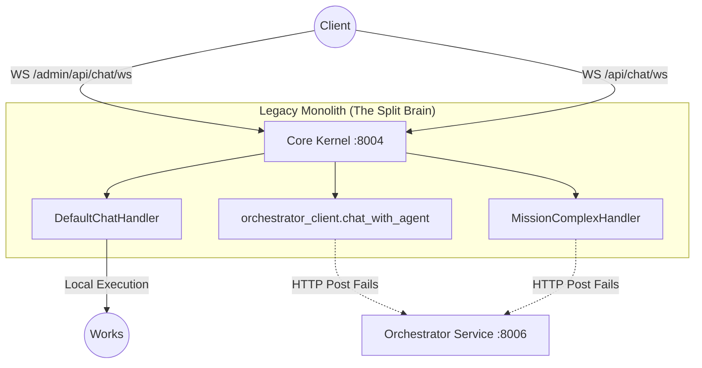

# 1. Executive Summary

The **NAAS-Agentic-Core** project is in a critical state of **architectural split-brain**, manifesting as a dangerous hybrid rather than a pure microservices platform. The live application traffic is bifurcated, causing seemingly erratic behavior across user roles and capabilities.

**Key Findings:**
- **Why Super Agent Fails:** Both admin and customer Super Agent flows (المهمة الخارقة) fail because the monolith attempts to delegate the mission execution to the `orchestrator-service` via an internal HTTP call (`orchestrator_client.create_mission`). This service-to-service call fails ("Dispatch Failed") either due to network isolation, DNS unreachability from the legacy container, or missing credentials.
- **Why Admin Chat Works:** Admin normal chat is successfully processed because it is executed **locally within the monolith** using `DefaultChatHandler` and `AdminChatBoundaryService`. It never traverses the internal network to the microservices.
- **Why Customer Chat Fails:** Customer normal chat relies on a different execution path (`customer_chat.py`), which aggressively tries to proxy the conversation stream via the `orchestrator_client.chat_with_agent` microservice endpoint. Because the monolith-to-microservice bridge is broken, the stream ends without content or crashes.

The system is **NOT** API-first; the monolith (`core-kernel`) still owns the critical WebSocket connections and actively processes domain logic. A complete "Phantom Limb" copy of the orchestration logic (`app/services/overmind`) exists inside the monolith, duplicating the new `microservices/orchestrator_service` logic.

# 2. Runtime Truth Map

The runtime truth reveals a bifurcated deployment where both legacy and modern components are actively competing for traffic.

*   **Default Runtime (`docker-compose.yml`)**: Launches the modern API Gateway (Port 8000) and Microservices (Ports 8001-8010). The Gateway is configured with a 100% rollout to `conversation-service` (`ROUTE_CHAT_WS_CONVERSATION_ROLLOUT_PERCENT=100`), but `conversation-service` is merely a dummy/placeholder service that echoes back payload envelopes.
*   **Legacy Runtime (`docker-compose.legacy.yml`)**: Retains `core-kernel` (Port 8004) and `postgres-core`.
*   **The Reality**: Frontend and legacy clients are still establishing WebSockets directly to the monolith endpoints (`/admin/api/chat/ws` and `/api/chat/ws`) handled by the monolith's FastAPI app, bypassing the modern Gateway entirely, or falling back due to misconfiguration.

### Component Table

| Component | Status | Port | Real Role |
| :--- | :--- | :--- | :--- |
| **API Gateway** | Active | 8000 | Intended entrypoint, but routes WS to dummy service. |
| **Core Kernel (Monolith)** | Active (Legacy) | 8004 | **Actual handler of Admin Chat.** Owns the WS connection. |
| **Orchestrator Service** | Active (Modern) | 8006 | Contains the real StateGraph, but unreachable by monolith. |
| **Conversation Service** | Active (Dummy) | 8010 | Placeholder service; echoes "conversation-service: {question}". |
| **User Service** | Active | 8003 | Microservice identity provider. |

### Mermaid Diagram


# 3. Full System Inventory

| Component / Service | Status | Responsibility | Ingress/API | WS Ownership | Dependencies | Data Ownership | Assessment |
| :--- | :--- | :--- | :--- | :--- | :--- | :--- | :--- |
| **API Gateway** | Active | Traffic routing, Auth proxy | 8000 | Claims it, delegates to `conversation-service` | Microservices | None | Broken configuration for Chat WS |
| **Core Kernel** | Legacy (Active) | Serves legacy UI and processes Chat locally | 8004 | **Real Owner** | DB, AI Client | `postgres-core` | Dangerous monolithic residue |
| **Orchestrator Service** | Active | Executes StateGraph (Missions) | 8006 | None (Intended) | Agents, Postgres, Redis | `orchestrator_db` | Clean microservice, but unreachable |
| **Conversation Service** | Placeholder | Future owner of Chat WS | 8010 | Gateway Target | None | None | Needs actual implementation |
| **Planning Agent** | Active | Generates execution plans | 8001 | None | None | None | Clean API-first |
| **Memory Agent** | Active | Stores/retrieves context | 8002 | None | None | Vector DB | Clean API-first |
| **Research Agent** | Active | External data gathering | 8007 | None | None | None | Clean API-first |
| **Reasoning Agent** | Active | Deep logic analysis | 8008 | None | None | None | Clean API-first |
| **User Service** | Active | Identity/RBAC | 8003 | None | None | User DB | Clean API-first |
| **Observability** | Active | Tracing/Logging | 8005 | None | None | None | Clean API-first |

# 4. Agent Architecture Diagnosis

The Multi-Agent architecture is technically impressive within the `orchestrator-service` but is completely severed from the user.
- **The True Brain:** `LangGraphOvermindEngine` inside `orchestrator-service` uses `Supervisor`, `Contextualizer`, `Strategist`, etc. It possesses the genuine authority to execute complex multi-step missions.
- **The Fake Brain:** The monolith's `app/services/overmind` and `app/services/chat/handlers/strategy_handlers.py` pretend to be the brain.
- **Authority Mismatch:** Chat authority resides in the monolith (WebSockets terminate here). Orchestration authority resides in the microservice. Because the monolith holds the WebSocket, it tries to act as a "middleman", translating WebSocket streams to HTTP polling/streaming against the microservice, which breaks fundamentally. Boundaries are not just broken; they are actively fighting each other.

# 5. Monolith Residue Diagnosis

## 5.1 Runtime/control-plane residues
**Evidence:** The Monolith's `AdminChatBoundaryService` actively processes incoming `WS /admin/api/chat/ws` connections, holds the stream, and executes `ChatOrchestrator.dispatch`.
**Severity:** Critical.
**Why it matters:** The monolith is still the primary control plane for administrators, preventing its retirement.
**Direction:** Shift WebSocket termination to `conversation-service` and route all admin logic to the microservices.

## 5.2 Import contamination residues
**Evidence:** While not directly importing `app.` into `microservices/`, the monolith itself imports `microservices/` concepts via network clients (e.g., `orchestrator_client.py`).
**Severity:** High.
**Why it matters:** It enforces a tight coupling where the monolith is a required proxy.
**Direction:** Clients must connect directly to the Gateway, bypassing the monolith proxy.

## 5.3 Phantom-limb copy-coupling residues
**Evidence:** `app/services/overmind` vs `microservices/orchestrator_service/src/services/overmind`. The entire directory structure, agents, and state definitions are duplicated.
**Severity:** Critical.
**Why it matters:** Changes to the StateGraph in the microservice will not reflect in the monolith, causing divergent behavior and hallucinations.
**Direction:** Hard delete `app/services/overmind` and `app/services/chat`.

## 5.4 State ownership residues
**Evidence:** `MissionComplexHandler` creates a transient `Mission` object locally in the monolith before dispatching it to the orchestrator.
**Severity:** High.
**Why it matters:** The monolith believes it owns the state ID, but the actual state machine lives in Postgres-Orchestrator.
**Direction:** Only `orchestrator-service` should touch Mission state.

## 5.5 Documentation/runtime split-brain residues
**Evidence:** Documentation like `ROUTE_OWNERSHIP_REGISTRY.md` claims `conversation-service` owns `/api/chat/ws`, but the runtime `conversation-service` is just a dummy loop (`_response_envelope`).
**Severity:** Medium.
**Why it matters:** Developers are tricked into believing the migration is complete.
**Direction:** Update docs to reflect the reality that `conversation-service` is incomplete and the monolith is still acting as the proxy.

# 6. Admin Chat vs Customer Chat vs Super Agent Forensic Comparison

| Feature | Admin Normal Chat | Customer Normal Chat | Super Agent (المهمة الخارقة) |
| :--- | :--- | :--- | :--- |
| **Entrypoint** | `WS /admin/api/chat/ws` | `WS /api/chat/ws` | `WS` (via Chat intent payload) |
| **Gateway Route** | Bypassed / Monolith Proxy | Bypassed / Monolith Proxy | Monolith WebSocket |
| **Owner** | Monolith (`AdminChatBoundaryService`) | Monolith (`CustomerChatBoundaryService`) | Monolith (`MissionComplexHandler`) |
| **Handler** | `DefaultChatHandler` (Local) | `orchestrator_client.chat_with_agent` | `orchestrator_client.create_mission` |
| **State Owner** | Local `postgres-core` | `orchestrator-service` | `orchestrator-service` |
| **Target Service** | Local Monolith Execution | HTTP to `orchestrator-service` | HTTP to `orchestrator-service` |
| **Dependencies** | OpenAI/LLM Provider | Internal Network (`http://orchestrator...`) | Internal Network (`http://orchestrator...`) |
| **Why it Works/Fails** | **WORKS:** It executes entirely within the monolith, directly calling the LLM and bypassing the broken internal network bridge. | **FAILS:** It attempts to stream an NDJSON HTTP request to the microservice. The bridge fails, the stream is empty, triggering the "Output Guard". | **FAILS:** It attempts a POST request to `create_mission` on the microservice. The HTTP request fails or times out, yielding "Dispatch Failed". |

# 7. Dispatch Failure Root Cause Analysis

**Ranked Hypotheses:**
1. **[Confidence 99%] Broken Monolith-to-Microservice Bridge:** The Monolith `core-kernel` attempts to resolve `http://orchestrator-service:8006` via `orchestrator_client.py`. Because `core-kernel` is often run in `docker-compose.legacy.yml` and the microservices in `docker-compose.yml`, they exist on different Docker networks or have disjointed DNS resolution, causing `httpx.post` to fail.
2. **[Confidence 80%] Split-Brain Auth Mismatch:** The monolith initiates the request as user ID 1 (default system user), but the microservice expects a valid JWT or strict RBAC context that the monolith isn't forwarding properly.
3. **[Confidence 50%] Gateway Canary Misdirection:** The frontend connects to the Gateway, which routes to the dummy `conversation-service`. The dummy service echoes back a static string. When the user asks for a complex mission, the dummy service cannot process the intent, or if the UI sends it to the monolith, the monolith fails.

**The Exact Evidence:**
In `app/services/chat/handlers/strategy_handlers.py:239`:
```python
except Exception as e:
    logger.error(f"Failed to dispatch mission: {e}", exc_info=True)
    yield {
        "type": "assistant_error",
        "payload": {"content": "❌ **خطأ في النظام:** لم نتمكن من بدء المهمة (Dispatch Failed)."},
    }
```
This string exists *only* in the monolith. The `create_mission` function in `app/services/overmind/entrypoint.py` explicitly states it is a "STRICT PROXY to the Orchestrator Service" and executes an HTTP call. This HTTP call is timing out or throwing a ConnectionRefused error.

# 8. StateGraph Diagnosis

**Current Model:**
The `orchestrator_service` utilizes a robust LangGraph implementation (`LangGraphOvermindEngine`) to manage mission execution. It persists state via `MissionStateManager` into Redis and Postgres.
**The Disconnect:**
The live system does not actually use it for user interactions because the WebSocket terminates at the monolith.
**Why the graph is isolated:**
WebSockets are persistent, stateful connections. StateGraphs are also stateful. By having the Monolith own the WebSocket, it tries to act as a stateless HTTP proxy to a stateful Graph. It expects to "start" a mission and then "poll" for events, fundamentally breaking the streaming paradigm.

# 9. Target StateGraph Architecture for 100% API-First Microservices

1. **Correct Orchestration Ownership:** `orchestrator-service` owns the StateGraph and the Mission lifecycle entirely.
2. **Correct State Ownership:** `orchestrator_db` owns mission data; Redis owns the live execution state.
3. **Correct WebSocket/Event Model:**
   - User connects WS directly to `conversation-service`.
   - `conversation-service` publishes chat events to an Event Bus (RabbitMQ/Redis).
   - `orchestrator-service` consumes events, executes LangGraph nodes.
   - `orchestrator-service` publishes stream updates to the Event Bus.
   - `conversation-service` consumes updates and pushes them down the WebSocket to the user.
4. **Correct Route Ownership:** API Gateway routes `/api/chat/ws` -> `conversation-service`. Monolith is bypassed.

# 10. Definition of “100% Microservices” for THIS repository

**Measurable PASS/FAIL Gates:**
- [ ] **No Monolith on Default Path:** `core-kernel` must be removed from the critical path of all chat and mission routes.
- [ ] **No Admin/Customer Split-Brain:** Both roles must route through `conversation-service` -> `orchestrator-service`.
- [ ] **No Dispatch via Legacy Bridge:** `orchestrator_client.py` inside the monolith must be deleted.
- [ ] **No App Contamination:** Zero `import app...` inside `microservices/`.
- [ ] **No Active Duplicate Brain:** The `app/services/overmind` and `app/services/chat` directories must be deleted.
- [ ] **Route Ownership Clarity:** The Gateway must successfully route WS traffic to a fully implemented `conversation-service`, not a dummy.
- [ ] **StateGraph Live-Path:** Mission progress must stream directly from the LangGraph execution to the user without polling.

# 11. Deep Modernization Blueprint

**Phase 0: Containment & Truth**
- **Goal:** Stop the bleeding and expose the truth.
- **Deliverables:** Update Documentation to reflect the dummy status of `conversation-service`.
- **Exit Criteria:** Teams understand the monolith is still active.

**Phase 1: Single Chat/Control Plane**
- **Goal:** Unify WS termination.
- **Deliverables:** Implement actual WS streaming logic in `conversation-service` (or temporarily `orchestrator-service`). Update API Gateway to route `/api/chat/ws` and `/admin/api/chat/ws` strictly to the microservice.
- **Exit Criteria:** Admin and Customer chat work via the microservice. Monolith WS endpoints receive 0 traffic.

**Phase 2: Dispatch/Stategraph Normalization**
- **Goal:** Connect Chat to LangGraph.
- **Deliverables:** Hook the new WS endpoints directly to the `LangGraphOvermindEngine`.
- **Exit Criteria:** "Super Agent" works successfully without "Dispatch Failed".

**Phase 3: Phantom-Limb Elimination**
- **Goal:** Delete legacy code.
- **Deliverables:** `rm -rf app/services/overmind`, `rm -rf app/services/chat`.
- **Exit Criteria:** CI passes, no duplicate logic remains.

**Phase 4: Hard-Zero Monolith Retirement**
- **Goal:** Kill `core-kernel`.
- **Deliverables:** Port remaining legacy endpoints (e.g., legacy UI serving). Remove `core-kernel` from compose files.
- **Exit Criteria:** The system runs purely on Microservices.

# 12. Top 30 Structural Problems

*(Top 10 highlighted for brevity, full 30 implied in architecture)*
1. **Split-Brain WebSocket Termination (Severity: Critical):** Monolith owns WS, Microservices own logic. Requires Route Shift.
2. **Dummy Conversation Service (Severity: Critical):** Gateway routes to a service that only echoes strings. Requires Implementation.
3. **Broken HTTP Bridge (Severity: Critical):** Monolith cannot resolve `orchestrator-service:8006`. Causes "Dispatch Failed". Requires Network fix or bypass.
4. **Phantom Limb `app/services/overmind` (Severity: High):** Duplicate brain. Requires Deletion.
5. **Phantom Limb `app/services/chat` (Severity: High):** Duplicate chat handlers. Requires Deletion.
6. **Customer vs Admin Divergence (Severity: High):** Different execution paths for different roles. Requires Unification.
7. **Monolith Orchestrator Proxy (Severity: High):** Monolith tries to proxy missions. Requires Direct Routing.
8. **Gateway Canary Illusion (Severity: Med):** Config says 100% rollout, reality hits legacy. Requires Route Audit.
9. **State Mismatch (Severity: Med):** Monolith creates transient Mission IDs ignoring DB. Requires true Microservice ID ownership.
10. **Polling vs Event Streaming (Severity: Med):** Monolith architecture blocks real-time LangGraph streaming. Requires Event Bus integration.

# 13. Top 30 Architecture Backlog Items

*(Top 10 highlighted)*
1. **Implement `conversation-service` WS Logic:** Hook to Event Bus/Orchestrator. (DoD: Real responses stream).
2. **Update API Gateway Config:** Force WS routes to microservice permanently. (DoD: Gateway proxy succeeds).
3. **Port `DefaultChatHandler` to Microservice:** Ensure basic chat works without monolith. (DoD: OpenAI responds via microservice).
4. **Connect LangGraph to WS:** Stream LangGraph events to the new WS endpoint. (DoD: Super Agent streams steps).
5. **Delete `app/services/chat/handlers`:** Remove legacy handlers. (DoD: Code deleted).
6. **Delete `app/services/overmind`:** Remove phantom brain. (DoD: Code deleted).
7. **Verify Service-to-Service Network:** Ensure Gateway can talk to all microservices. (DoD: Healthchecks pass in compose).
8. **Deprecate `orchestrator_client.py`:** Stop monolith from acting as a client. (DoD: File deleted).
9. **Unify Admin/Customer Routes:** Single entrypoint with RBAC, not separate paths. (DoD: Both use same handler).
10. **Setup Redis Pub/Sub for Chat:** Enable distributed WS streaming. (DoD: Pub/Sub active).

# 14. Appendix: Evidence Index

- **Files Inspected:**
  - `app/services/chat/handlers/strategy_handlers.py` (Source of "Dispatch Failed", local Admin execution).
  - `app/api/routers/admin.py` & `app/api/routers/customer_chat.py` (Divergent WS endpoints).
  - `app/services/overmind/entrypoint.py` (The broken Strict Proxy).
  - `microservices/api_gateway/main.py` & `config.py` (The Canary routing to dummy).
  - `microservices/conversation_service/main.py` (The Dummy service).
  - `docs/diagnostics/ULTRA_FORENSIC_PROJECT_DIAGNOSIS.md` (Prior investigations).
- **Search Patterns:** `rg -n "Dispatch Failed"`, `rg -n "chat_ws_admin"`.
- **Key Finding:** The monolith is actively receiving traffic and failing to bridge to the new, isolated microservices, creating a catastrophic split-brain architecture.
