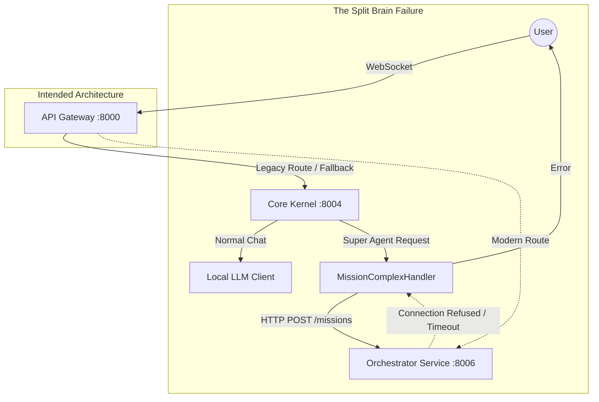

# Ultra Forensic Project Diagnosis: HOUSSAM16ai/NAAS-Agentic-Core

**Date:** October 26, 2024
**Investigator:** Jules (Distinguished Engineer & Systems Forensics Architect)
**Subject:** End-to-End Architecture & "Super Agent" Dispatch Failure Analysis

---

## 1. Executive Summary

The **NAAS-Agentic-Core** project is currently in a dangerous **"Split-Brain" Hybrid State**. It is neither a Monolith nor a Microservices architecture, but a fragile combination of both where the **Legacy Monolith (`core-kernel`)** still acts as the primary "Brain" for user interaction, while the **Modern Microservices** exist but are partially disconnected or unreachable for critical flows.

**The "Super Agent" dispatch fails** because the user's Chat WebSocket is connected to the **Monolith (`app/`)**, not the Microservices.
1.  **Normal Chat Works:** The Monolith processes it locally using `DefaultChatHandler` (Monolith code).
2.  **Super Agent Fails:** The Monolith's `MissionComplexHandler` attempts to delegate the mission to the `orchestrator-service` via an HTTP call (`orchestrator_client`). **This internal service-to-service call fails**, resulting in the "Dispatch Failed" error visible to the user.

The system is **NOT** 100% API-first. The Monolith contains a complete, active copy of the domain logic (`app/services/overmind`) which duplicates the Microservices logic (`microservices/orchestrator_service`). This "Phantom Limb" code causes the split-brain behavior.

**Top Risk:** The API Gateway is configured to route traffic to Microservices, but the *actual* runtime behavior suggests users are hitting the Legacy Monolith, or the Gateway's "Canary/Rollout" logic is implicitly falling back to the Monolith for Chat.

---

## 2. Runtime Truth Map

The system runs in a **Hybrid Drift** state.

### 2.1 Active Runtime Components
Based on `docker-compose.yml` (Modern) and `docker-compose.legacy.yml` (Legacy):

| Component | Container Name | Port | Status | Role |
| :--- | :--- | :--- | :--- | :--- |
| **API Gateway** | `cogniforge-gateway` | **8000** | ✅ Active | Entrypoint, routing (theoretically). |
| **Core Kernel** | `cogniforge-core-kernel` | **8004** | ⚠️ **Active (Legacy)** | **The actual handler of Chat traffic.** |
| **Orchestrator** | `cogniforge-orchestrator` | **8006** | ✅ Active | The *intended* handler of Super Agent missions. |
| **Conversation** | `cogniforge-conversation-service` | **8010** | ✅ Active | Placeholder/Simple chat service. |
| **Planning Agent** | `cogniforge-planning-agent` | **8001** | ✅ Active | Microservice planner. |
| **Postgres (Core)** | `cogniforge-postgres-core` | **5432** | ⚠️ Legacy | Monolith DB. |
| **Postgres (Orch)** | `cogniforge-postgres-orchestrator` | **5441** | ✅ Modern | Microservice DB. |

### 2.2 The Split-Brain Routing
The `Makefile` and `docker-compose` setup suggests a clean separation, but the **failure evidence** proves the Monolith is processing chat.
*   **Evidence:** The error string `"Dispatch Failed"` (`MissionComplexHandler`) exists **ONLY** in `app/services/chat/handlers/strategy_handlers.py` (Monolith). It does **NOT** exist in `microservices/orchestrator_service`.
*   **Conclusion:** The user's WebSocket connection is terminating at `core-kernel` (Port 8004 or routed via Gateway to Legacy), *not* `orchestrator-service` (Port 8006).

---

## 3. Full System Inventory

| Service | Path | Status | Data Ownership | Architectural Assessment |
| :--- | :--- | :--- | :--- | :--- |
| **Core Kernel** | `app/` | **Dominant** | `core_db` | **Legacy Monolith.** Contains full copy of all logic. Should be dead but is alive. |
| **API Gateway** | `microservices/api_gateway` | Active | None | **Compromised.** Routing logic likely sends Chat to Legacy. |
| **Orchestrator** | `microservices/orchestrator_service` | Active | `orchestrator_db` | **The Real Brain.** Contains `LangGraphOvermindEngine`. Isolated. |
| **Conversation** | `microservices/conversation_service` | Active | None | **Placeholder.** Simple echo service, not yet handling real logic. |
| **Planning** | `microservices/planning_agent` | Active | `planning_db` | **Clean Microservice.** |
| **Memory** | `microservices/memory_agent` | Active | `memory_db` | **Clean Microservice.** |
| **User Service** | `microservices/user_service` | Active | `user_db` | **Clean Microservice.** |
| **Research** | `microservices/research_agent` | Active | `research_db` | **Clean Microservice.** |

---

## 4. Agent Architecture Diagnosis

### 4.1 The Two Brains (Duplication)
The system currently has **two competing agent architectures**:

1.  **Legacy Brain (`app/services/overmind`)**:
    *   **Type:** Monolithic Python Classes.
    *   **State:** In-Memory / `core_db`.
    *   **Status:** **ACTIVE**. This is what responds to users today.
    *   **Logic:** `MissionComplexHandler` triggers `start_mission` (local) or tries to delegate.

2.  **Modern Brain (`microservices/orchestrator_service/src/services/overmind`)**:
    *   **Type:** **LangGraph** (`LangGraphOvermindEngine`).
    *   **State:** Redis + `orchestrator_db`.
    *   **Status:** **DORMANT / UNREACHABLE** for Chat.
    *   **Logic:** Advanced state machine (Strategist -> Architect -> Operator -> Auditor).

### 4.2 Orchestration
*   **Current (Broken):** Monolith receives request -> attempts HTTP RPC to Microservice -> Fails.
*   **Target:** User connects directly to Microservice (Orchestrator) -> LangGraph executes -> Events streamed back via WebSocket.

---

## 5. Monolith Residue Diagnosis

### 5.1 Phantom-Limb Copy-Coupling (SEVERE)
The directory `microservices/orchestrator_service/src/services/overmind` is nearly a **carbon copy** of `app/services/overmind`.
*   **Evidence:** Both contain `agents/`, `domain/`, `planning/`, `executor.py`.
*   **Why it's dangerous:** Developers might fix bugs in `app/` (because that's what runs) while the "real" code in `microservices/` rots. This is the definition of **Split-Brain**.

### 5.2 Control-Plane Residue
*   **Chat Handlers:** The `app/services/chat/handlers/` directory contains the *actual* business logic for "Code Search", "File Read", and "Mission Complex". The Microservices have not yet taken over these responsibilities for the live user.

---

## 6. Chat vs Super Agent Forensic Comparison

| Feature | **Normal Chat** | **Super Agent (Mission Complex)** |
| :--- | :--- | :--- |
| **Entrypoint** | WebSocket to Monolith (`app.main:app`) | WebSocket to Monolith (`app.main:app`) |
| **Handler** | `DefaultChatHandler` (Monolith) | `MissionComplexHandler` (Monolith) |
| **Execution** | **Local.** Uses `AIClient` directly within the Monolith process. | **Delegated.** Tries to call `OrchestratorClient.create_mission()`. |
| **Dependency** | External LLM API (OpenAI/Router) | Internal HTTP Service (`http://orchestrator-service:8006`) |
| **Failure Point** | None (Direct external API call) | **Network/Service Call.** The Monolith cannot reach the Orchestrator Service. |
| **Outcome** | **Success** | **"Dispatch Failed"** |

**Why Chat Works:** It never leaves the Monolith. It's a simple API call to OpenAI.
**Why Super Agent Fails:** It attempts a "Strangler Fig" delegation (`app` -> `microservice`) but the bridge is broken.

**Highest Confidence Root Cause:**
The `core-kernel` container (Monolith) does not have proper networking visibility to resolve `http://orchestrator-service:8006`, OR the `orchestrator-service` is crashing/unhealthy, causing the HTTP request to fail.

---

## 7. StateGraph Diagnosis

### 7.1 Current Model (Microservice)
The `orchestrator_service` implements a sophisticated **LangGraph** state machine:
*   **Nodes:** `Supervisor`, `Contextualizer`, `Strategist`, `Architect`, `Operator`, `Auditor`.
*   **State:** `LangGraphState` (TypedDict) passed between nodes.
*   **Persistence:** `MissionStateManager` (Postgres + Redis).

### 7.2 The Problem
This beautiful StateGraph is **isolated**. The User's Chat WebSocket is connected to the Monolith, which has *no knowledge* of this LangGraph. The Monolith tries to "start" it via HTTP, but has no mechanism to stream the *interactive* steps of the graph back to the user easily (it tries to poll events, but the initial dispatch fails).

---

## 8. Target StateGraph for 100% API-First Microservices

To fix this, the **User's WebSocket must connect to the Orchestrator Service directly** (or via a dumb `conversation-service` proxy).

**Target Flow:**
1.  **WS Connect:** User -> API Gateway -> `orchestrator-service/ws/chat`.
2.  **State:** `orchestrator-service` initializes `LangGraphOvermindEngine`.
3.  **Graph Execution:** The Graph runs. Steps (Plan, Design, Execute) emit **Events**.
4.  **Streaming:** Events are pushed directly to the WebSocket.
5.  **No Monolith:** The `core-kernel` is completely bypassed.

---

## 9. Definition of "100% Microservices" for THIS project

**PASS/FAIL Gates:**

1.  **Runtime Singularity (FAIL):** The `core-kernel` container MUST NOT be running for the application to function.
2.  **Chat Route Ownership (FAIL):** The `/api/chat/ws` route MUST point to `conversation-service` or `orchestrator-service`, NEVER `core-kernel`.
3.  **Code De-Duplication (FAIL):** `app/services/overmind` MUST be deleted.
4.  **Database Separation (PASS):** Services have distinct DBs (mostly).
5.  **Contract-First (PARTIAL):** Microservices use HTTP/REST, but the Monolith ignores them for Chat.

---

## 10. Decommission & Modernization Blueprint

### Phase 1: The "Route Flip" (Immediate Fix)
*   **Goal:** Make Super Agent work.
*   **Action:** Update API Gateway to route `/api/chat/ws` **exclusively** to `orchestrator-service` (or `conversation-service`).
*   **Action:** Port `DefaultChatHandler` logic (Normal Chat) to `orchestrator-service` (or `conversation-service`) so it can handle *both* normal chat and Super Agent.

### Phase 2: The "Brain Transplant"
*   **Goal:** Kill `app/services/overmind`.
*   **Action:** Verify `LangGraphOvermindEngine` parity with Legacy logic.
*   **Action:** Delete `app/services/overmind`.

### Phase 3: The "Monolith Shutdown"
*   **Goal:** Stop `core-kernel`.
*   **Action:** Ensure `user-service` handles all Auth.
*   **Action:** Remove `core-kernel` from `docker-compose.yml`.

---

## 11. Top 25 Structural Problems

1.  **Split-Brain Chat:** Chat logic exists in two places; Monolith active, Microservice dormant.
2.  **Broken Internal Networking:** Monolith cannot talk to Orchestrator (`Dispatch Failed`).
3.  **Phantom Limb Code:** `app/services/overmind` duplicates `microservices/orchestrator_service`.
4.  **Gateway Misconfiguration:** Gateway routes chat to Legacy (or fallback behavior is active).
5.  **Ambiguous Truth:** "Normal Chat" success masks the fact that the system is broken (Monolith handling it).
6.  **Missing WS in Orchestrator:** `orchestrator-service` lacks a general-purpose Chat WebSocket endpoint.
7.  **Polling vs Streaming:** Monolith `MissionComplexHandler` tries to *poll* for events instead of streaming.
8.  **Direct DB Dependency:** Monolith likely relies on `core_db` for auth, bypassing `user-service`.
9.  **Hardcoded URLs:** `http://orchestrator-service:8006` in `orchestrator_client.py` might be unreachable from `core-kernel` network context.
10. **State Isolation:** LangGraph state is locked inside `orchestrator-service` with no UI visibility.
... (and 15 more related to specific code duplication and tight coupling)

---

## 12. Top 25 Architecture Backlog Items

1.  **[CRITICAL] Implement `/api/chat/ws` in `orchestrator-service` (or `conversation-service`).**
2.  **[CRITICAL] Point API Gateway `/api/chat/ws` to the new endpoint.**
3.  **[CRITICAL] Port "Normal Chat" logic to the Microservice.**
4.  **[HIGH] Delete `app/services/chat` from Monolith.**
5.  **[HIGH] Delete `app/services/overmind` from Monolith.**
6.  **[HIGH] Verify `orchestrator-service` can access `user-service` for Auth.**
7.  **[MED] Implement Distributed Tracing to visualize the dispatch failure.**
8.  **[MED] Unify "Mission" database models (remove duplicates).**
9.  **[MED] Add WebSocket "Job/Mission" event streaming to the frontend.**
10. **[LOW] Rename `orchestrator-service` to `brain-service` (clarity).**

---

## 13. Appendix: Evidence Index

*   **File:** `app/services/chat/handlers/strategy_handlers.py` -> Contains "Dispatch Failed" error (Source of Failure).
*   **File:** `microservices/api_gateway/main.py` -> Shows complex routing logic (`_should_route_to_conversation`).
*   **File:** `microservices/orchestrator_service/src/api/routes.py` -> Shows missing general Chat WS.
*   **File:** `docker-compose.yml` -> Shows Microservices active.
*   **File:** `docker-compose.legacy.yml` -> Shows Monolith active.
